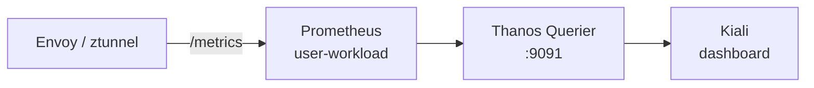

# OpenShift Service Mesh 3.3: Setup

This guide covers the installation of Red Hat OpenShift Service Mesh 3.3 (via the Sail Operator), Kiali, and demonstrates both traditional Sidecar injection and the new Ambient mesh architecture with the bookinfo application from the Istio project.

A **service mesh** is an infrastructure layer that transparently adds **encryption (mTLS)**, **observability (metrics, traces)**, and **traffic control (routing, authorization)** to service-to-service communication — without modifying application code.

OpenShift Service Mesh 3.3 offers two data-plane architectures:

| | **Sidecar Mode** | **Ambient Mode** |
|---|---|---|
| Proxy location | One Envoy per pod (injected container) | Shared ztunnel (per-node) + optional waypoint (per-namespace) |
| Resource overhead | Higher (memory/CPU per pod) | Lower (shared infrastructure) |
| L7 policy | Always available | Only when waypoint is deployed |
| Pod restart required | Yes (to inject sidecar) | No (transparent enrollment) |

## Prerequisites

Install the **OpenShift Service Mesh 3.3 Operator** and the **Kiali Operator** via the OpenShift OperatorHub before proceeding. Additionally, we will need: 

- An OpenShift cluster with cluster-admin privileges
- The `oc` CLI installed and logged in
- The `istioctl` CLI (installation steps included below)

> *NOTE*: The scripts provided here have been executed in an OpenShift Web Terminal, available via the installation of the **Web Terminal** operator


## Install and Configure `istioctl`

> **What:** Install the `istioctl` CLI binary on your workstation or Web Terminal.
>
> **Why:** `istioctl` lets you inspect proxy configurations, view certificates, debug connectivity issues, and check ztunnel state — capabilities not available through `oc` alone.

Obtain the download URL from the OpenShift Console or the OSSM documentation, then:

```bash
# Download the AMD64 binary
curl -L -O <DOWNLOAD_URL>
 
# Extract the archive
tar xzvf <FILENAME>.tar.gz
 
# Add to PATH (Web Terminal, trasient state)
export PATH=$PATH:~/istioctl-linux-amd64
```

✅ Validation

```bash
istioctl version --short
```

Expected output:

```
client version: 1.28.5
```


## Kiali instance

> **What:** Deploy Kiali — the observability console for OpenShift Service Mesh.
>
> **Why:** Kiali provides a real-time topology graph of your services, showing traffic flow, error rates, and latency. It queries Prometheus metrics exposed by the mesh proxies (Envoy sidecars or ztunnel) and visualises them. Without Kiali, you'd need to craft PromQL queries manually.

Create a default Kiali instance from the OperatorHub-installed Kiali Operator in the `kiali` namespace.

Firstly, create the namespace. 

```bash
cat <<EOF | oc apply -f -
apiVersion: v1
kind: Namespace
metadata:  
  name: kiali
spec: {}
EOF
```

Secondly, create the Kiali instance, directly from the `Ecosystem / Installed` Operators menu option. Accept all the defaults. 

> **NOTE**: If you postpone Kiali configuration until after the application is deployed, you can observe exactly what each step does in real-time. Application monitoring will fail in various ways until all Kiali components and RBAC permissions are correctly configured.

Access the Kiali dashboard:

```bash
echo https://$(oc get route kiali -n kiali -o jsonpath='{.spec.host}')
```

<details>
<summary>✅ Validation</summary>

```bash
oc get pods -n kiali
```

Expected output:
```
NAME                    READY   STATUS    RESTARTS   AGE
kiali-xxxxx-xxxxx       1/1     Running   0          XXs
```

```bash
oc get kiali -n kiali
```

Expected output:
```
NAME    AGE
kiali   XXs
```

```bash
oc get route kiali -n kiali -o jsonpath='{.spec.host}'
```

Expected output:
```
kiali-kiali.apps.<cluster-domain>
```

</details>

## Enable User Workload Monitoring

> **What:** Enable OpenShift's built-in Prometheus stack for user namespaces.
>
> **Why:** By default, OpenShift only monitors platform components (`openshift-*` namespaces). The mesh proxies expose metrics in your application namespace, so you need user workload monitoring turned on for Prometheus to scrape them and for Kiali to display traffic data.

> **Reference:** [https://docs.redhat.com/en/documentation/monitoring_stack_for_red_hat_openshift/4.20/html/configuring_user_workload_monitoring/preparing-to-configure-the-monitoring-stack-uwm#configurable-monitoring-components_preparing-to-configure-the-monitoring-stack-uwm](https://docs.redhat.com/en/documentation/monitoring_stack_for_red_hat_openshift/4.20/html/configuring_user_workload_monitoring/preparing-to-configure-the-monitoring-stack-uwm#configurable-monitoring-components_preparing-to-configure-the-monitoring-stack-uwm)

```bash
cat <<EOF | oc apply -f -
apiVersion: v1
kind: ConfigMap
metadata:
  name: cluster-monitoring-config
  namespace: openshift-monitoring
data:
  config.yaml: |
    enableUserWorkload: true
EOF
```

✅ Validation

```bash
oc get pods -n openshift-user-workload-monitoring
```

Expected output (wait a minute for pods to come up):

```
NAME                                   READY   STATUS    RESTARTS   AGE
prometheus-user-workload-0             6/6     Running   0          XXs
prometheus-user-workload-1             6/6     Running   0          XXs
thanos-ruler-user-workload-0           4/4     Running   0          XXs
thanos-ruler-user-workload-1           4/4     Running   0          XXs
```


## Point Kiali to Thanos Querier

> **What:** Configure Kiali to query metrics from Thanos Querier (the unified Prometheus endpoint in OpenShift).
>
> **Why:** OpenShift aggregates all Prometheus data through Thanos Querier. Kiali needs to know where to find this endpoint and how to authenticate (using its own ServiceAccount token). Without this, the Kiali dashboard shows "No metrics available".



Patch the Kiali CR (`kiali` instance in the `kiali` namespace) to point at the in-cluster Thanos Querier endpoint:

```bash
oc patch kiali kiali -n kiali --type=merge -p '
spec:
  external_services:
    prometheus:
      url: "https://thanos-querier.openshift-monitoring.svc:9091"
      auth:
        type: "bearer"
        use_kiali_token: true
'
```

✅ Validation

```bash
oc get kiali kiali -n kiali -o jsonpath='{.spec.external_services.prometheus.url}'
```

Expected output:

```
https://thanos-querier.openshift-monitoring.svc:9091
```


## Fix 403 Error — Grant Kiali Monitoring Access

> **What:** Grant the Kiali ServiceAccount the `cluster-monitoring-view` ClusterRole.
>
> **Why:** Thanos Querier is protected by RBAC. Even though Kiali knows the endpoint, its ServiceAccount token will get a 403 unless it has explicit permission to read cluster-wide monitoring data. This is an OpenShift security boundary — platform metrics aren't exposed to arbitrary workloads by default.

After updating the endpoint you may see a **403 Forbidden** error. Grant the Kiali service account the required cluster role:

```bash
oc adm policy add-cluster-role-to-user cluster-monitoring-view \
  -z kiali-service-account -n kiali
```

✅ Validation

```bash
oc adm policy who-can get pods --subresource=prometheus-metrics -n openshift-monitoring | grep kiali-service-account
```

Or verify with:

```bash
oc get clusterrolebinding -o wide | grep kiali-service-account
```

Expected output (should show the `cluster-monitoring-view` binding):

```
cluster-monitoring-view-xxxxx   ClusterRole/cluster-monitoring-view   ...   kiali/kiali-service-account
```
