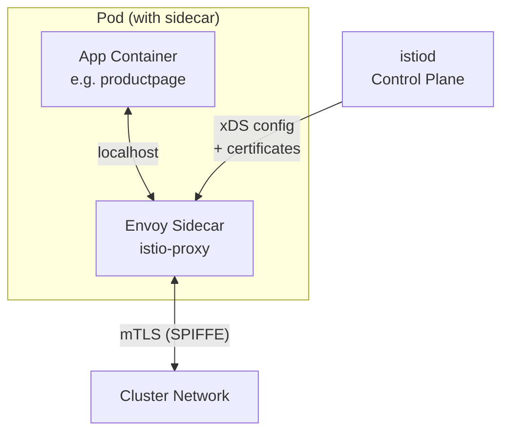
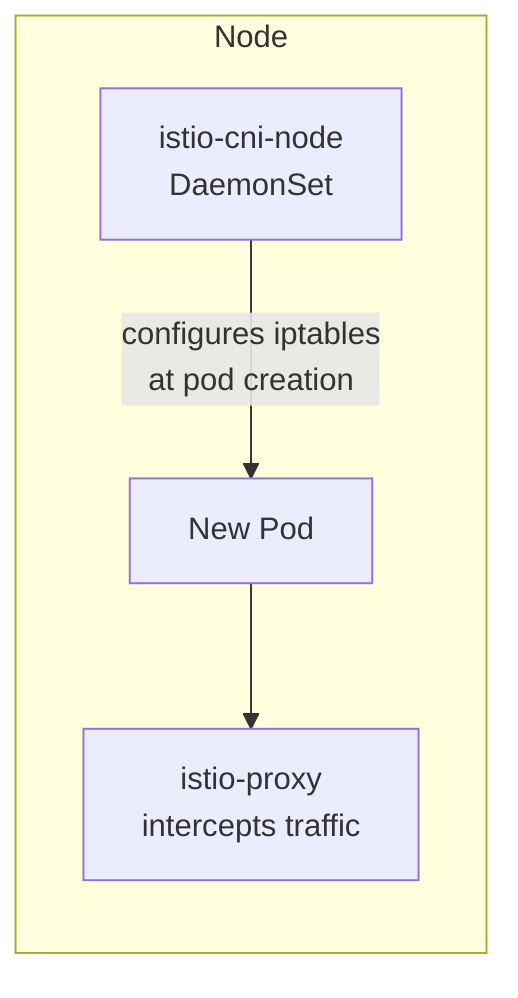
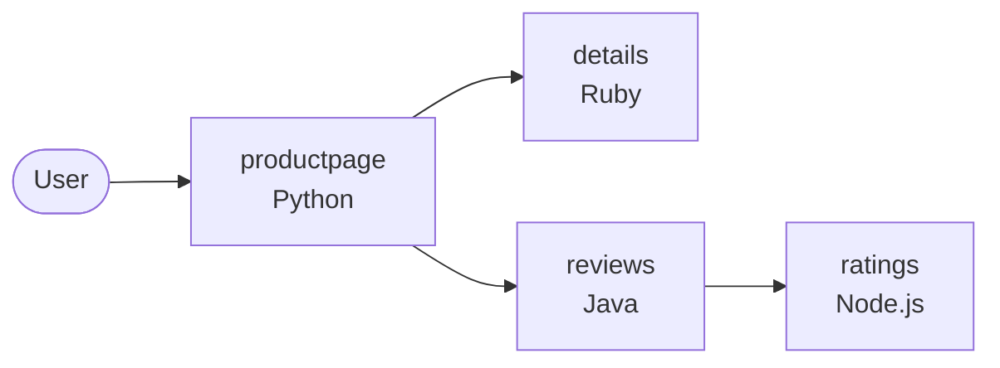
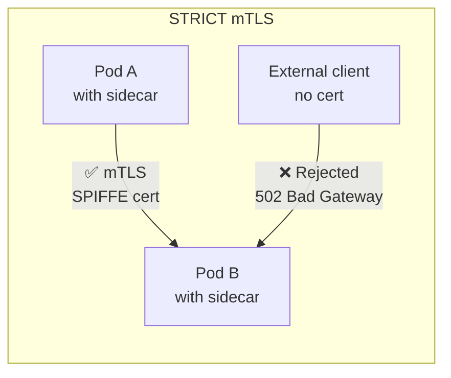
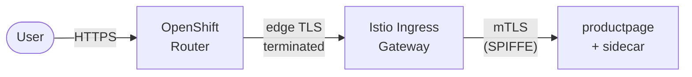
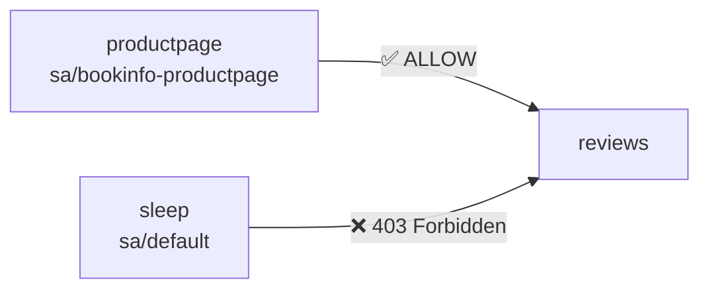

# A. Sidecar Mode

> **Reference:** [https://docs.redhat.com/en/documentation/red_hat_openshift_service_mesh/3.3/html-single/installing/index#ossm-sidecar-injection](https://docs.redhat.com/en/documentation/red_hat_openshift_service_mesh/3.3/html-single/installing/index#ossm-sidecar-injection)

In sidecar mode, every application pod gets an **Envoy proxy** injected as an additional container. All inbound and outbound traffic for the pod flows through this proxy, which handles mTLS, metrics collection, and policy enforcement transparently.



## A.1 Components installation


### A.1.1 Install Istio CNI plugin

> **What:** Deploy the Istio CNI DaemonSet — one pod per node that configures network rules.
>
> **Why:** On OpenShift, pods run with restricted security contexts and cannot modify their own iptables. The CNI plugin runs as a privileged DaemonSet and sets up the network redirection rules (iptables/nftables) at pod creation time, so the sidecar can intercept traffic without the application needing elevated permissions.



```bash
# Create istio-cni project
cat <<EOF | oc apply -f -
apiVersion: v1
kind: Namespace
metadata:  
  name: istio-cni
spec: {}
---
kind: IstioCNI
apiVersion: sailoperator.io/v1
metadata:
  name: default
spec:
  namespace: istio-cni
  version: v1.28.5
EOF
```

<details>
<summary>✅ Validation</summary>

```bash
oc get istiocni default -o jsonpath='{.status.state}'
```

Expected output:

```
Healthy
```

```bash
oc get pods -n istio-cni
```

Expected output (one pod per node):

```
NAME                   READY   STATUS    RESTARTS   AGE
istio-cni-node-xxxxx   1/1     Running   0          XXs
istio-cni-node-xxxxx   1/1     Running   0          XXs
...
```

</details>

### A.1.2 Istio Control Plane

> **What:** Deploy `istiod` — the Istio control plane that manages the entire mesh.
>
> **Why:** istiod is the "brain" of the mesh. It:
> - Issues short-lived mTLS certificates (SPIFFE identities) to every proxy
> - Pushes routing rules, policies, and service discovery info via the xDS API
> - Watches only namespaces labelled `istio-discovery: enabled` (discovery selector), keeping the blast radius controlled
>
> Without istiod, the proxies have no configuration and no certificates.

```bash
# Create the control plane namespace and 
#  the Istio resource with a discovery selector
#  (only namespaces labelled istio-discovery=enabled will be managed)
cat <<EOF | oc apply -f -
apiVersion: v1
kind: Namespace
metadata:  
  name: istio-system
spec: {}
---
apiVersion: sailoperator.io/v1
kind: Istio
metadata:
  name: default
spec:
  namespace: istio-system
  values:
    meshConfig:
      discoverySelectors:
        - matchLabels:
            istio-discovery: enabled
EOF
```

<details>
<summary>✅ Validation</summary>

```bash
oc get istio default -o jsonpath='{.status.state}'
```

Expected output:

```
Healthy
```

```bash
oc get pods -n istio-system
```

Expected output:

```
NAME                      READY   STATUS    RESTARTS   AGE
istiod-xxxxx-xxxxx        1/1     Running   0          XXs
```

</details>

## A.2 Application deployment

### A.2.1 Deploy the Bookinfo Application

> **What:** Deploy the Istio Bookinfo sample application — a polyglot microservices app with 4 services (productpage, details, reviews, ratings).
>
> **Why:** We deploy it first *without* the mesh to establish a baseline. You'll see each pod has exactly 1 container. After enabling sidecar injection, the count jumps to 2 — proving the proxy was injected transparently without changing the application manifests.



```bash
# Create the application namespace
cat <<EOF | oc apply -f -
apiVersion: v1
kind: Namespace
metadata:  
  name: bookinfo
spec: {}
EOF

# Deploy the Bookinfo sample app (without sidecars yet)
oc apply -f https://raw.githubusercontent.com/openshift-service-mesh/istio/release-1.24/samples/bookinfo/platform/kube/bookinfo.yaml -n bookinfo
```

<details>
<summary>✅ Validation</summary>

```bash
oc get pods -n bookinfo
```

Expected output (1 container per pod, no sidecar yet):

```
NAME                              READY   STATUS    RESTARTS   AGE
details-v1-xxxxx-xxxxx            1/1     Running   0          XXs
productpage-v1-xxxxx-xxxxx        1/1     Running   0          XXs
ratings-v1-xxxxx-xxxxx            1/1     Running   0          XXs
reviews-v1-xxxxx-xxxxx            1/1     Running   0          XXs
reviews-v2-xxxxx-xxxxx            1/1     Running   0          XXs
reviews-v3-xxxxx-xxxxx            1/1     Running   0          XXs
```


Optionally, expose the app directly to verify it works before mesh injection:

```bash

</details>

# Expose the productpage deployment
oc expose deployment/productpage -n bookinfo
 
# Create an edge-terminated route
cat <<EOF | oc apply -f -
apiVersion: route.openshift.io/v1
kind: Route
metadata:
  labels:
    app: productpage
    service: productpage
  name: productpage
  namespace: bookinfo
spec:
  port:
    targetPort: http
  tls:
    termination: edge
  to:
    kind: ""
    name: productpage
EOF
 
# Print the route URL
echo https://$(oc get -n bookinfo route productpage -ojsonpath='{.spec.host}')
```

You can also verify individual microservices from within the cluster (For instance, from the Web Terminal):

```bash
# Details service
curl -s http://details.bookinfo.svc:9080/details/0 | jq
 
# Reviews service
curl -s http://reviews.bookinfo.svc:9080/reviews/0 | jq
```


### A.2.2 Enable Sidecar Injection

> **What:** Label the namespace with `istio-injection: enabled` and restart the pods.
>
> **Why:** The Istio mutating admission webhook watches for pods being created in labelled namespaces and automatically injects the `istio-proxy` container. Existing pods need a restart because injection only happens at pod creation time. After this step, all inter-service communication is automatically proxied through Envoy — enabling mTLS, metrics, and policy enforcement.

Label the namespace to enable both mesh discovery and automatic sidecar injection:

```bash
cat <<EOF | oc apply -f -
apiVersion: v1
kind: Namespace
metadata:
  name: bookinfo
  labels:
    istio-discovery: enabled
    istio-injection: enabled
EOF
```

Restart all workloads so the sidecars are injected, then watch the pods come back up:

```bash
# Trigger a rolling restart
oc rollout restart deployments -n bookinfo
 
# Watch pods — you should see 2 containers per pod (app + istio-proxy)
oc get pod -n bookinfo -w
```

<details>
<summary>✅ Validation</summary>

```bash
oc get namespace bookinfo --show-labels | grep istio
```

Expected output (should contain both labels):

```
bookinfo   Active   XXm   istio-discovery=enabled,istio-injection=enabled,...
```

```bash
oc get pods -n bookinfo -o custom-columns="NAME:.metadata.name,READY:.status.containerStatuses[*].ready,CONTAINERS:.spec.containers[*].name"
```

Expected output (2 containers per pod — app + istio-proxy):

```
NAME                              READY        CONTAINERS
details-v1-xxxxx-xxxxx            true,true    details,istio-proxy
productpage-v1-xxxxx-xxxxx        true,true    productpage,istio-proxy
ratings-v1-xxxxx-xxxxx            true,true    ratings,istio-proxy
reviews-v1-xxxxx-xxxxx            true,true    reviews,istio-proxy
reviews-v2-xxxxx-xxxxx            true,true    reviews,istio-proxy
reviews-v3-xxxxx-xxxxx            true,true    reviews,istio-proxy
```

</details>

### A.2.3 Configure Prometheus Scraping

> **What:** Create a `PodMonitor` that tells Prometheus to scrape the Envoy proxy metrics endpoint.
>
> **Why:** Each Envoy sidecar exposes detailed L7 metrics (request count, latency histograms, error rates) on `/stats/prometheus`. However, Prometheus won't scrape them unless you explicitly create a `PodMonitor` resource. Without this, Kiali's traffic graph remains empty even though everything else is working — a common "gotcha" during setup.

Create a `PodMonitor` for all sidecar-injected pods in the `bookinfo` namespace:

```bash
cat <<EOF | oc apply -f -
apiVersion: monitoring.coreos.com/v1
kind: PodMonitor
metadata:
  name: bookinfo-proxies-monitor
  namespace: bookinfo
  labels:
    k8s-app: istio
spec:
  selector:
    matchExpressions:
    - key: security.istio.io/tlsMode
      operator: Exists
  podMetricsEndpoints:
  - path: /stats/prometheus
    port: http-envoy-prom
    interval: 15s
    relabelings:
    - action: keep
      sourceLabels: [__meta_kubernetes_pod_container_name]
      regex: "istio-proxy"
    - action: replace
      sourceLabels: [__meta_kubernetes_pod_label_app]
      targetLabel: app
    - action: replace
      sourceLabels: [__meta_kubernetes_pod_label_version]
      targetLabel: version
EOF
```

<details>
<summary>✅ Validation</summary>

```bash
oc get podmonitor -n bookinfo
```

Expected output:

```
NAME                       AGE
bookinfo-proxies-monitor   XXs
```

```bash
oc get pods -n openshift-user-workload-monitoring -l app.kubernetes.io/name=prometheus -o jsonpath='{.items[0].status.phase}'
```

Expected output (Prometheus is running and will pick up the new PodMonitor):

```
Running
```

</details>

## A.3. Security and Networking

### A.3.1 Enforce mTLS

> **What:** Apply a `PeerAuthentication` policy with `mode: STRICT` to require mutual TLS for all traffic in the namespace.
>
> **Why:** By default, Istio uses "permissive" mTLS — it accepts both plaintext and encrypted connections. Setting STRICT means **only** clients with a valid mesh certificate (SPIFFE identity) can communicate with services in this namespace. This is the foundation of zero-trust networking: every connection is authenticated and encrypted, even inside the cluster.



Apply a `PeerAuthentication` policy to enforce mutual TLS (mTLS) for all workloads in the `bookinfo` namespace:

```bash
cat <<EOF | oc apply -f -
apiVersion: security.istio.io/v1
kind: PeerAuthentication
metadata:
  name: default
  namespace: bookinfo
spec:
  mtls:
    mode: STRICT
EOF
```

<details>
<summary>✅ Validation</summary>

```bash
oc get peerauthentication -n bookinfo
```

Expected output:

```
NAME      MODE     AGE
default   STRICT   XXs
```

Verify mTLS is enforced (the direct route should now fail):

```bash
curl -sk https://$(oc get route productpage -n bookinfo -o jsonpath='{.spec.host}')/productpage
```

Expected output:

```
(empty response or 502 Bad Gateway)
```


> **Note:** Once STRICT mTLS is active, the direct `productpage` route created earlier will return a **502 Bad Gateway**, because the OpenShift Router cannot complete the mTLS handshake. An Istio Ingress Gateway is required — see Section 3.2.

</details>

### A.3.2 Deploy the Ingress Gateway

> **What:** Deploy an Envoy-based Ingress Gateway as the entry point for external traffic into the mesh.
>
> **Why:** With STRICT mTLS enabled, the OpenShift Router can no longer reach the pods directly (it doesn't have a mesh certificate). The Ingress Gateway sits at the mesh edge: it terminates external TLS from the Router and initiates mTLS towards the backend pods. It's the "front door" that bridges the external world and the encrypted mesh.



Deploy the Envoy-based ingress gateway workload (Service, Deployment, RBAC):

```bash
oc apply -f https://raw.githubusercontent.com/istio-ecosystem/sail-operator/main/chart/samples/ingress-gateway.yaml -n bookinfo
```

Create the Istio `Gateway` and `VirtualService` resources for Bookinfo:

```bash
oc apply -f https://raw.githubusercontent.com/openshift-service-mesh/istio/release-1.24/samples/bookinfo/networking/bookinfo-gateway.yaml -n bookinfo
```

Expose the ingress gateway via an OpenShift Route:

```bash
cat <<EOF | oc apply -f -
apiVersion: route.openshift.io/v1
kind: Route
metadata:
  name: istio-ingressgateway
  namespace: bookinfo
spec:
  port:
    targetPort: http2
  tls:
    termination: edge
  to:
    kind: Service
    name: istio-ingressgateway
EOF
```

<details>
<summary>✅ Validation</summary>

```bash
oc get pods -n bookinfo -l istio=ingressgateway
```

Expected output:

```
NAME                                    READY   STATUS    RESTARTS   AGE
istio-ingressgateway-xxxxx-xxxxx        2/2     Running   0          XXs
```

```bash
oc get route istio-ingressgateway -n bookinfo -o jsonpath='{.spec.host}'
```

Expected output:

```
istio-ingressgateway-bookinfo.apps.<cluster-domain>
```

Test the application through the ingress gateway:

```bash
curl -sk https://$(oc get route istio-ingressgateway -n bookinfo -o jsonpath='{.spec.host}')/productpage | grep -o "<title>.*</title>"
```

Expected output:

```
<title>Simple Bookstore App</title>
```

</details>

### A.3.3 Inspect Certificate / SPIFFE Identity

> **What:** Extract and examine the X.509 certificate that istiod issued to a sidecar proxy.
>
> **Why:** Every proxy gets a short-lived certificate with a SPIFFE URI (`spiffe://cluster.local/ns/<namespace>/sa/<service-account>`) as its identity. This is what makes identity-based authorization possible — policies reference these URIs, not IP addresses. Inspecting the cert proves that the identity system is working and shows you the exact identity string to use in AuthorizationPolicies.

Use `istioctl` to inspect the certificate of any sidecar-injected pod:

```bash
# Set the pod name first
POD_TO_INSPECT=<pod-name>
 
istioctl proxy-config secret $POD_TO_INSPECT -n bookinfo -o json | \
  jq -r '.dynamicActiveSecrets[]? | select(.name=="default") | .secret.tlsCertificate.certificateChain.inlineBytes' | \
  base64 --decode | openssl x509 -text -noout
```

<details>
<summary>✅ Validation</summary>

The certificate output should contain a SPIFFE URI in the Subject Alternative Name:

```
X509v3 Subject Alternative Name: critical
    URI:spiffe://cluster.local/ns/bookinfo/sa/<service-account-name>
```

</details>

### A.3.4 Test with a Sleep Pod

> **What:** Deploy a minimal curl pod *inside* the mesh (with sidecar) to test service-to-service connectivity.
>
> **Why:** Since STRICT mTLS is active, you can't test from outside the mesh anymore. The sleep pod gets its own SPIFFE identity and can make authenticated mTLS calls to other services. This lets you verify that mesh-internal connectivity works before adding authorization restrictions.

Deploy a curl-based pod with sidecar injection enabled to test connectivity from within the mesh:

```bash
oc run sleep \
  --image=curlimages/curl \
  --restart=Never \
  -n bookinfo \
  --labels="sidecar.istio.io/inject=true" \
  -- sleep 3600
```

Exec into the pod (e.g. via the OpenShift Web Terminal) and test access to the Reviews service:

```bash
curl -I -X GET reviews:9080/reviews/0
# Expected: HTTP 200 OK
```

<details>
<summary>✅ Validation</summary>

```bash
oc get pod sleep -n bookinfo -o jsonpath='{.status.containerStatuses[*].name}'
```

Expected output (pod running with sidecar):

```
sleep istio-proxy
```

From inside the sleep pod:

```bash
oc exec sleep -n bookinfo -c sleep -- curl -s -o /dev/null -w "%{http_code}" reviews:9080/reviews/0
```

Expected output:

```
200
```

</details>

### A.3.5 Authorization Policy

> **What:** Create an `AuthorizationPolicy` that only allows `productpage` (by its SPIFFE identity) to call the `reviews` service.
>
> **Why:** This is zero-trust in action. Even though `sleep` and `productpage` are both in the mesh with valid certificates, only the explicitly allowed identity can reach `reviews`. Every other caller gets a 403 Forbidden. This is a powerful security primitive: access is based on cryptographic identity, not network location or IP addresses.



Restrict access to the `reviews` service so that only `productpage` (identified by its SPIFFE/mTLS identity) is permitted:

```bash
cat <<EOF | oc apply -f -
apiVersion: security.istio.io/v1
kind: AuthorizationPolicy
metadata:
  name: reviews-identity-enforcement
  namespace: bookinfo
spec:
  selector:
    matchLabels:
      app: reviews
  action: ALLOW
  rules:
  - from:
    - source:
        principals: ["cluster.local/ns/bookinfo/sa/bookinfo-productpage"]
EOF
```

After applying this policy, the `sleep` pod should receive a **403 Forbidden** when attempting to reach `reviews`, while `productpage` continues to work normally.

<details>
<summary>✅ Validation</summary>

```bash
oc get authorizationpolicy -n bookinfo
```

Expected output:

```
NAME                           AGE
reviews-identity-enforcement   XXs
```

Verify that the sleep pod is now denied access to reviews:

```bash
oc exec sleep -n bookinfo -c sleep -- curl -s -o /dev/null -w "%{http_code}" reviews:9080/reviews/0
```

Expected output:

```
403
```

Verify that productpage can still reach reviews (app still works end-to-end):

```bash
curl -sk https://$(oc get route istio-ingressgateway -n bookinfo -o jsonpath='{.spec.host}')/productpage | grep -o "<title>.*</title>"
```

Expected output:

```
<title>Simple Bookstore App</title>
```

</details>

## A.4. Cleanup

```
oc delete namespace bookinfo
oc delete istio default
oc delete istiocni default
oc delete namespace istio-system
oc delete namespace istio-cni
```
