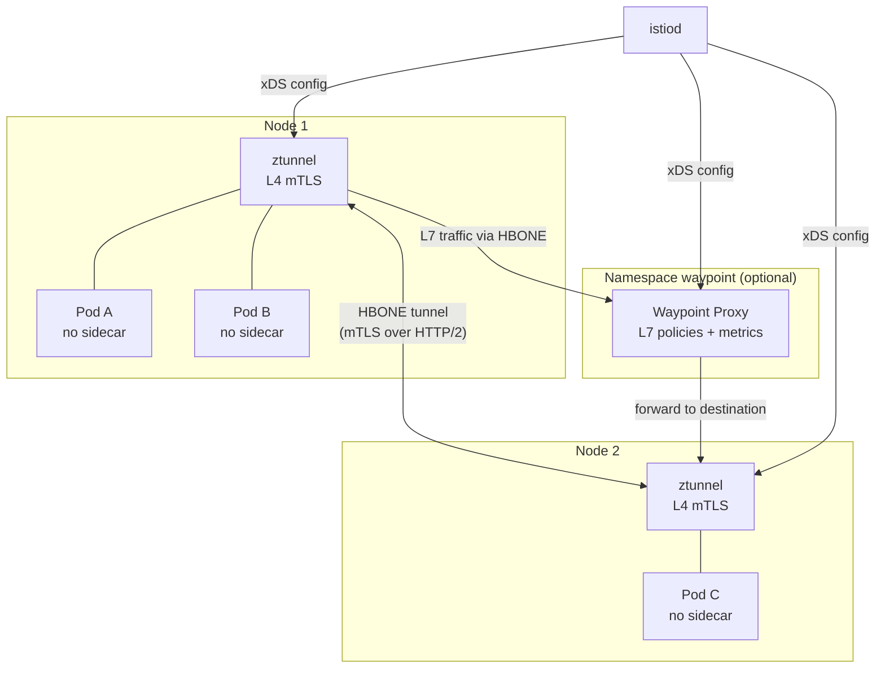
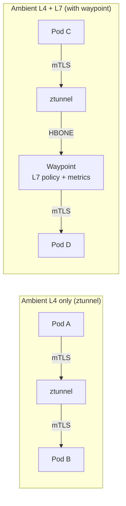
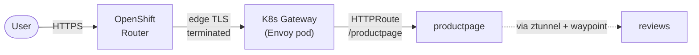

# B. Ambient Mode

Ambient mode is a fundamentally different architecture from sidecar mode. Instead of injecting a proxy into every pod, it uses **shared infrastructure** at the node level:

- **ztunnel** (per-node DaemonSet): Handles L4 concerns — mTLS encryption, connection-level telemetry, and basic authorization. All pods on the node share this component.
- **Waypoint proxy** (per-namespace, optional): Handles L7 concerns — HTTP routing, request-level metrics, and L7 authorization policies. Only deployed when you need it.



The key advantage: **pods don't need to be restarted** to join the mesh. Labelling the namespace is enough, and ztunnel picks up traffic transparently.

## B.0 Prerequisites — Configure Cluster Networking

> **What:** Enable `routingViaHost` in the OVN-Kubernetes network plugin configuration.
>
> **Why:** Ambient mode's ztunnel runs on the host network namespace and intercepts pod traffic using nftables rules. For this interception to work, pod egress traffic must be routed through the host network stack (rather than being bridged directly). This is a cluster-wide change that affects how OVN-Kubernetes handles the default gateway for pods.

> **Reference:** [https://docs.redhat.com/en/documentation/red_hat_openshift_service_mesh/3.3/html-single/installing/index#ossm-istio-ambient-mode](https://docs.redhat.com/en/documentation/red_hat_openshift_service_mesh/3.3/html-single/installing/index#ossm-istio-ambient-mode)

Ambient mode requires that OVN-Kubernetes routes traffic via the host. Patch the cluster Network Operator to enable `routingViaHost`:

```bash
oc patch network.operator cluster --type=merge -p '
spec:
  defaultNetwork:
    ovnKubernetesConfig:
      gatewayConfig:
        routingViaHost: true
'
```

> **Note:** This change triggers a rolling reboot of the cluster nodes. Wait for all nodes to return to `Ready` before proceeding.

✅ Validation

```bash
oc get network.operator cluster -o jsonpath='{.spec.defaultNetwork.ovnKubernetesConfig.gatewayConfig.routingViaHost}'
```

Expected output:

```
true
```

Confirm all nodes are back to Ready:

```bash
oc get nodes -o custom-columns="NAME:.metadata.name,STATUS:.status.conditions[-1].type,READY:.status.conditions[-1].status" | grep -v "True"
```

Expected output (no nodes should appear — all are Ready):

```
NAME    STATUS   READY
```


## B.1 Components installation

For scoping the service mesh with discovery selector to limit the scope of the OSSM in Istio ambient mode. The configuration controls which namespaces the control plane discovers based on label selectors. 

### B.1.1. Install ZTunnel

> **What:** Deploy the ztunnel DaemonSet — a lightweight, Rust-based L4 proxy that runs on every node.
>
> **Why:** ztunnel is the core data-plane component in ambient mode. It transparently intercepts all TCP traffic from enrolled pods and wraps it in mTLS (using the HBONE protocol — HTTP/2-based tunneling). Unlike Envoy sidecars, ztunnel only handles L4 (connection-level) concerns, making it significantly lighter on resources.

```bash
cat <<EOF | oc apply -f -
apiVersion: v1
kind: Namespace
metadata:  
  name: istio-ztunnel
spec: {}
---
apiVersion: sailoperator.io/v1
kind: ZTunnel
metadata:
  name: default
  namespace: istio-ztunnel
  labels:
    istio-discovery: enabled
spec:
  namespace: istio-ztunnel
  profile: ambient
EOF
```

✅ Validation

The validation steps for step B.1.1 we should do after step B.1.3


### B.1.2. Install Istio CNI plugin

> **What:** Install the Istio CNI plugin with the `ambient` profile.
>
> **Why:** In ambient mode, the CNI plugin configures nftables rules that redirect pod traffic to the ztunnel process on the node. This is different from sidecar mode where it sets up iptables for the sidecar — here it redirects to the node-level ztunnel instead. Without it, pod traffic bypasses the mesh entirely.

We install the Istio CNI in ambient mode as well

```bash
# Create istio-cni project and IstioCNI
cat <<EOF | oc apply -f -
apiVersion: v1
kind: Namespace
metadata:  
  name: istio-cni
  labels:
    istio-discovery: enabled
spec: {}
---
apiVersion: sailoperator.io/v1
kind: IstioCNI
metadata:
  name: default
spec:
  namespace: istio-cni
  profile: ambient
EOF
```

✅ Validation

```bash
oc get istiocni default -o jsonpath='{.status.state}'
```

Expected output:

```
Healthy
```

```bash
oc get pods -n istio-cni -l k8s-app=istio-cni-node
```

Expected output (one pod per node):

```
NAME                   READY   STATUS    RESTARTS   AGE
istio-cni-node-xxxxx   1/1     Running   0          XXs
istio-cni-node-xxxxx   1/1     Running   0          XXs
...
```


### B.1.3. Install Istio control plane

> **What:** Deploy istiod with the `ambient` profile and configure it to trust the ztunnel namespace.
>
> **Why:** istiod in ambient mode has additional responsibilities compared to sidecar mode: it provisions certificates for ztunnel (not individual pods), manages waypoint proxy configurations, and coordinates the HBONE tunnel setup. The `trustedZtunnelNamespace` tells istiod which namespace hosts the ztunnel DaemonSet it should trust for certificate requests.

We install the istio resource in ambient mode: 

```bash
cat <<EOF | oc apply -f -
apiVersion: v1
kind: Namespace
metadata:  
  name: istio-system
  labels:
    istio-discovery: enabled
spec: {}
---
apiVersion: sailoperator.io/v1
kind: Istio
metadata:
  name: default
spec:
  namespace: istio-system
  profile: ambient
  values:
    pilot:
      trustedZtunnelNamespace: istio-ztunnel
  meshConfig:
    discoverySelectors:
    - matchLabels:
        istio-discovery: enabled
EOF
```

✅ Validation

```bash
oc get istio default -o jsonpath='{.status.state}'
```

Expected output:

```
Healthy
```

```bash
oc get pods -n istio-system
```

Expected output:

```
NAME                      READY   STATUS    RESTARTS   AGE
istiod-xxxxx-xxxxx        1/1     Running   0          XXs
```

We can now also check for the creation of ztunnel

```bash
oc get ztunnel default -n istio-ztunnel -o jsonpath='{.status.state}'
```

Expected output:

```
Healthy
```

```bash
oc get pods -n istio-ztunnel -l app=ztunnel
```

Expected output (one pod per node):

```
NAME              READY   STATUS    RESTARTS   AGE
ztunnel-xxxxx     1/1     Running   0          XXs
ztunnel-xxxxx     1/1     Running   0          XXs
...
```


## B.2 Deploy the bookinfo app

> **What:** Deploy the same Bookinfo app, but this time enrol the namespace into ambient mode via the `istio.io/dataplane-mode: ambient` label.
>
> **Why:** Unlike sidecar mode, you don't need to restart pods or inject containers. The moment the namespace is labelled, ztunnel begins intercepting traffic for all pods in it. Notice the pods still show 1/1 containers — no sidecar is injected. The mesh is completely transparent at the infrastructure level.

```bash
cat <<EOF | oc apply -f -
apiVersion: v1
kind: Namespace
metadata:  
  name: bookinfo
  labels:
    istio-discovery: enabled
    istio.io/dataplane-mode: ambient
spec: {}
EOF
oc apply -n bookinfo -f https://raw.githubusercontent.com/openshift-service-mesh/istio/release-1.24/samples/bookinfo/platform/kube/bookinfo.yaml
oc apply -n bookinfo -f https://raw.githubusercontent.com/openshift-service-mesh/istio/release-1.24/samples/bookinfo/platform/kube/bookinfo-versions.yaml
```

✅ Validation

```bash
oc get pods -n bookinfo
```

Expected output (1 container per pod — no sidecar in ambient mode):

```
NAME                              READY   STATUS    RESTARTS   AGE
details-v1-xxxxx-xxxxx            1/1     Running   0          XXs
productpage-v1-xxxxx-xxxxx        1/1     Running   0          XXs
ratings-v1-xxxxx-xxxxx            1/1     Running   0          XXs
reviews-v1-xxxxx-xxxxx            1/1     Running   0          XXs
reviews-v2-xxxxx-xxxxx            1/1     Running   0          XXs
reviews-v3-xxxxx-xxxxx            1/1     Running   0          XXs
```

```bash
oc get namespace bookinfo --show-labels | grep ambient
```

Expected output (should contain the ambient label):

```
bookinfo   Active   XXs   istio-discovery=enabled,istio.io/dataplane-mode=ambient,...
```


Confirm that Ztunnel proxy has successfully opened listening sockets in the pod network namespace by running the following command:

```bash
istioctl ztunnel-config workloads --namespace istio-ztunnel
```

✅ Validation

The output should list all bookinfo workloads with their IP addresses and `PROTOCOL: HBONE`:

```
NAMESPACE   POD NAME                          IP           NODE        WAYPOINT   PROTOCOL
bookinfo    details-v1-xxxxx-xxxxx            10.x.x.x    worker-0               HBONE
bookinfo    productpage-v1-xxxxx-xxxxx        10.x.x.x    worker-0               HBONE
bookinfo    ratings-v1-xxxxx-xxxxx            10.x.x.x    worker-1               HBONE
bookinfo    reviews-v1-xxxxx-xxxxx            10.x.x.x    worker-1               HBONE
...
```


### Install the Waypoint Proxy

> **What:** Deploy a waypoint proxy (an Envoy instance managed via the Kubernetes Gateway API) and enrol the namespace to route traffic through it.
>
> **Why:** ztunnel only handles L4 (TCP-level) — it can encrypt traffic and enforce connection-level policies, but it cannot inspect HTTP headers, route by path, or collect L7 metrics. The waypoint proxy adds L7 capabilities (HTTP routing, request-level authorization, detailed metrics) for services that need it. It's a **shared** Envoy instance for the namespace, not one per pod.



```bash
cat <<EOF | oc apply -f -
apiVersion: gateway.networking.k8s.io/v1
kind: Gateway
metadata:
  labels:
    istio.io/waypoint-for: service
  name: waypoint
  namespace: bookinfo
spec:
  gatewayClassName: istio-waypoint
  listeners:
  - name: mesh
    port: 15008
    protocol: HBONE
EOF
```

Enroll the bookinfo namespace to use the waypoint

```bash
oc label namespace bookinfo istio.io/use-waypoint=waypoint
```

✅ Validation

```bash
oc get gateway waypoint -n bookinfo -o jsonpath='{.status.conditions[?(@.type=="Programmed")].status}'
```

Expected output:

```
True
```

```bash
oc get pods -n bookinfo -l gateway.networking.k8s.io/gateway-name=waypoint
```

Expected output:

```
NAME                        READY   STATUS    RESTARTS   AGE
waypoint-xxxxx-xxxxx        1/1     Running   0          XXs
```

Check enrollment:

```bash
istioctl ztunnel-config svc --namespace istio-ztunnel
```

Expected output (services should show the waypoint address):

```
NAMESPACE   SERVICE NAME   SERVICE VIP   WAYPOINT          PROTOCOL
bookinfo    details        10.x.x.x      10.x.x.x:15008   HBONE
bookinfo    productpage    10.x.x.x      10.x.x.x:15008   HBONE
bookinfo    ratings        10.x.x.x      10.x.x.x:15008   HBONE
bookinfo    reviews        10.x.x.x      10.x.x.x:15008   HBONE
...
```


### Configure Metrics Scraping

> **What:** Create `PodMonitor` resources for both ztunnel and the waypoint proxy.
>
> **Why:** In ambient mode, metrics are split across two components: ztunnel emits L4 connection metrics (bytes sent/received, connection duration) and the waypoint emits L7 request metrics (HTTP status codes, latency). Both need their own PodMonitor so Prometheus scrapes them and Kiali can render the complete traffic graph.

```bash
cat <<EOF | oc apply -f - 
apiVersion: monitoring.coreos.com/v1
kind: PodMonitor
metadata:
  name: ztunnel-monitor
  namespace: istio-ztunnel
spec:
  selector:
    matchLabels:
      app: ztunnel
  podMetricsEndpoints:
  - port: ztunnel-stats
    path: /metrics
    interval: 15s
---
apiVersion: monitoring.coreos.com/v1
kind: PodMonitor
metadata:
  name: waypoint-monitor
  namespace: bookinfo
spec:
  selector:
    matchLabels:
      gateway.networking.k8s.io/gateway-name: waypoint
  podMetricsEndpoints:
  - port: metrics
    path: /metrics
    interval: 15s
EOF
```

✅ Validation

```bash
oc get podmonitor -n istio-ztunnel
```

Expected output:

```
NAME               AGE
ztunnel-monitor    XXs
```

```bash
oc get podmonitor -n bookinfo
```

Expected output:

```
NAME                AGE
waypoint-monitor    XXs
```


## B.3. Security and Networking

### Expose the Application via Kubernetes Gateway API

> **What:** Create a Kubernetes Gateway (using `gatewayClassName: istio`) and an HTTPRoute to expose the bookinfo app externally.
>
> **Why:** In ambient mode, we use the standard **Kubernetes Gateway API** (rather than Istio's older `Gateway`/`VirtualService` CRDs). This is a more portable, upstream-first approach. The `istio` gatewayClassName tells the Sail Operator to spin up an Envoy pod that acts as the ingress. We then create an OpenShift Route to bridge external HTTPS traffic to this gateway.



We can expose the app via a Gateway (k8s): 

```bash
# Create the Gateway
cat <<EOF | oc apply -f -
apiVersion: gateway.networking.k8s.io/v1
kind: Gateway
metadata:
  name: bookinfo-ingress-gateway
  namespace: bookinfo
  annotations:
    networking.istio.io/service-type: ClusterIP
spec:
  gatewayClassName: istio
  listeners:
  - name: http
    port: 80
    protocol: HTTP
    allowedRoutes:
      namespaces:
        from: Same
EOF
```

✅ Validation

```bash
oc get gateway bookinfo-ingress-gateway -n bookinfo -o jsonpath='{.status.conditions[?(@.type=="Programmed")].status}'
```

Expected output:

```
True
```

```bash
oc get pods -n bookinfo -l gateway.networking.k8s.io/gateway-name=bookinfo-ingress-gateway
```

Expected output:

```
NAME                                              READY   STATUS    RESTARTS   AGE
bookinfo-ingress-gateway-istio-xxxxx-xxxxx        1/1     Running   0          XXs
```


After the gateway is deployed, we will see the envoy proxy that has been spinned up by the previous CRD (gatewayClassName istio). We can now create an HTTPRoute object that will inject the traffic into the mesh

```bash
cat <<EOF | oc apply -f -
apiVersion: gateway.networking.k8s.io/v1
kind: HTTPRoute
metadata:
  name: bookinfo-entry-route
  namespace: bookinfo
spec:
  parentRefs:
  - name: bookinfo-ingress-gateway
  rules:
  - matches:
    - path:
        type: Exact
        value: /productpage
    - path:
        type: PathPrefix
        value: /static
    - path:
        type: Exact
        value: /login
    - path:
        type: Exact
        value: /logout
    - path:
        type: PathPrefix
        value: /api/v1/products
    backendRefs:
    - name: productpage
      port: 9080
EOF
```

Now, we can create a route to the gateway. 

```bash
cat <<EOF | oc apply -f -
apiVersion: route.openshift.io/v1
kind: Route
metadata:
  name: main
  namespace: bookinfo
spec:
  to:
    kind: Service
    name: bookinfo-ingress-gateway-istio
    weight: 100
  port:
    targetPort: 80 # The port defined in your Gateway listener
  tls:
    termination: edge # Optional: Let the OpenShift Router handle external TLS
    insecureEdgeTerminationPolicy: Redirect
EOF
```

✅ Validation

```bash
oc get httproute -n bookinfo
```

Expected output:

```
NAME                   HOSTNAMES   AGE
bookinfo-entry-route               XXs
```

```bash
oc get route main -n bookinfo -o jsonpath='{.spec.host}'
```

Expected output:

```
main-bookinfo.apps.<cluster-domain>
```

Test the application through the route:

```bash
curl -sk https://$(oc get route main -n bookinfo -o jsonpath='{.spec.host}')/productpage | grep -o "<title>.*</title>"
```

Expected output:

```
<title>Simple Bookstore App</title>
```


We check that we can reach the pod from outside the mesh (Web Terminal, for instance) 

```bash
# It reteurns the info about the author (William Shakespeare) and the publication
curl http://details.bookinfo.svc:9080/details/0 
```

### Restart Pods for nftables Enrollment

> **What:** Perform a rolling restart of all deployments and generate traffic.
>
> **Why:** If the pods were created *before* the ambient label was applied to the namespace, the CNI plugin hasn't yet configured the nftables interception rules for those pods. A restart triggers the CNI plugin to set up the rules at pod creation time. After this, traffic flows through ztunnel and appears in Kiali.

Restart all workloads so the nftables rules are applied, then watch the pods come back up:

```bash
# Trigger a rolling restart
oc rollout restart deployments -n bookinfo
 
# Watch pods — you should see 2 containers per pod (app + istio-proxy)
oc get pod -n bookinfo -w
```

✅ Validation

```bash
oc get pods -n bookinfo -l app=productpage -o jsonpath='{.items[0].status.phase}'
```

Expected output:

```
Running
```

Generate some traffic and verify Kiali can see the graph:

```bash
for i in $(seq 1 5); do curl -sk https://$(oc get route main -n bookinfo -o jsonpath='{.spec.host}')/productpage > /dev/null; done
```


### Enforce mTLS in Ambient Mode

> **What:** Apply `PeerAuthentication` with STRICT mode — same CRD as sidecar mode.
>
> **Why:** This demonstrates that the same security policies work across both architectures. In ambient mode, ztunnel enforces the STRICT requirement: any connection that doesn't present a valid mesh identity is rejected at the L4 level. Clients outside the mesh (like the Web Terminal pod) will see their connections immediately reset because ztunnel drops them before they reach the application.

```bash
cat <<EOF | oc apply -f -
apiVersion: security.istio.io/v1
kind: PeerAuthentication
metadata:
  name: default
  namespace: bookinfo
spec:
  mtls:
    mode: STRICT
EOF
```

Now a cURL from the web terminal will not succeed. 

```bash
# Now, we get an error
curl http://details.bookinfo.svc:9080/details/0 
```

We can explore, then, the gateway logs: 

```bash
# Will show the blocked request after applying the PeerAuthorization CRD at namespace level.  
oc logs -n istio-ztunnel -l app=ztunnel -c istio-proxy --tail=100 | grep details
```

✅ Validation

```bash
oc get peerauthentication -n bookinfo
```

Expected output:

```
NAME      MODE     AGE
default   STRICT   XXs
```

Verify mTLS enforcement (plain HTTP from outside the mesh should fail):

```bash
oc exec -n openshift-console deployment/console -c console -- curl -s -o /dev/null -w "%{http_code}" http://details.bookinfo.svc:9080/details/0
```

Expected output (connection refused or reset):

```
000
```

Check ztunnel logs for denied connections:

```bash
oc logs -n istio-ztunnel -l app=ztunnel -c istio-proxy --tail=20 | grep -i "denied\|RBAC\|details"
```

Expected output (should show denied/blocked entries):

```
... inbound connection from ... denied ...
```


## B.4. Cleanup

```
oc delete istio default
oc delete istiocni default
oc delete ztunnel default
oc delete namespace bookinfo
oc delete namespace istio-system
oc delete namespace istio-cni
oc delete namespace istio-ztunnel
```
