# OpenShift Service Mesh 3.3: Sidecar and Ambient Mode Walkthrough

This guide covers the installation of Red Hat OpenShift Service Mesh 3.3 (via the Sail Operator), Kiali, and demonstrates both traditional Sidecar injection and the new Ambient mesh architecture with the bookinfo application from the Istio project.

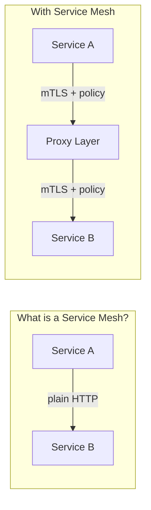

A **service mesh** is an infrastructure layer that transparently adds **encryption (mTLS)**, **observability (metrics, traces)**, and **traffic control (routing, authorization)** to service-to-service communication — without modifying application code.

OpenShift Service Mesh 3.3 offers two data-plane architectures:

| | **Sidecar Mode** | **Ambient Mode** |
|---|---|---|
| Proxy location | One Envoy per pod (injected container) | Shared ztunnel (per-node) + optional waypoint (per-namespace) |
| Resource overhead | Higher (memory/CPU per pod) | Lower (shared infrastructure) |
| L7 policy | Always available | Only when waypoint is deployed |
| Pod restart required | Yes (to inject sidecar) | No (transparent enrollment) |

## Installation

### Prerequisites

Install the **OpenShift Service Mesh 3.3 Operator** and the **Kiali Operator** via the OpenShift OperatorHub before proceeding. Additionally, we will need: 

- An OpenShift cluster with cluster-admin privileges
- The `oc` CLI installed and logged in
- The `istioctl` CLI (installation steps included below)

> *NOTE*: The scripts provided here have been executed in an OpenShift Web Terminal, available via the installation of the **Web Terminal** operator


### Install and Configure `istioctl`

> **What:** Install the `istioctl` CLI binary on your workstation or Web Terminal.
>
> **Why:** `istioctl` lets you inspect proxy configurations, view certificates, debug connectivity issues, and check ztunnel state — capabilities not available through `oc` alone.

Obtain the download URL from the OpenShift Console or the OSSM documentation, then:

```bash
# Download the AMD64 binary
curl -L -O <DOWNLOAD_URL>
 
# Extract the archive
tar xzvf <FILENAME>.tar.gz
 
# Add to PATH (Web Terminal, trasient state)
export PATH=$PATH:~/istioctl-linux-amd64
```

✅ Validation

```bash
istioctl version --short
```

Expected output:

```
client version: 1.28.5
```


### Kiali instance

> **What:** Deploy Kiali — the observability console for OpenShift Service Mesh.
>
> **Why:** Kiali provides a real-time topology graph of your services, showing traffic flow, error rates, and latency. It queries Prometheus metrics exposed by the mesh proxies (Envoy sidecars or ztunnel) and visualises them. Without Kiali, you'd need to craft PromQL queries manually.

Create a default Kiali instance from the OperatorHub-installed Kiali Operator in the `kiali` namespace.

Firstly, create the namespace. 

```bash
cat <<EOF | oc apply -f -
apiVersion: v1
kind: Namespace
metadata:  
  name: kiali
spec: {}
EOF
```

Secondly, create the Kiali instance, directly from the `Ecosystem / Installed` Operators menu option. Accept all the defaults. 

> **NOTE**: If you postpone Kiali configuration until after the application is deployed, you can observe exactly what each step does in real-time. Application monitoring will fail in various ways until all Kiali components and RBAC permissions are correctly configured.

Access the Kiali dashboard:

```bash
echo https://$(oc get route kiali -n kiali -o jsonpath='{.spec.host}')
```

<details>
<summary>✅ Validation</summary>

```bash
oc get pods -n kiali
```

Expected output:
```
NAME                    READY   STATUS    RESTARTS   AGE
kiali-xxxxx-xxxxx       1/1     Running   0          XXs
```

```bash
oc get kiali -n kiali
```

Expected output:
```
NAME    AGE
kiali   XXs
```

```bash
oc get route kiali -n kiali -o jsonpath='{.spec.host}'
```

Expected output:
```
kiali-kiali.apps.<cluster-domain>
```

</details>

### Enable User Workload Monitoring

> **What:** Enable OpenShift's built-in Prometheus stack for user namespaces.
>
> **Why:** By default, OpenShift only monitors platform components (`openshift-*` namespaces). The mesh proxies expose metrics in your application namespace, so you need user workload monitoring turned on for Prometheus to scrape them and for Kiali to display traffic data.

> **Reference:** [https://docs.redhat.com/en/documentation/monitoring_stack_for_red_hat_openshift/4.20/html/configuring_user_workload_monitoring/preparing-to-configure-the-monitoring-stack-uwm#configurable-monitoring-components_preparing-to-configure-the-monitoring-stack-uwm](https://docs.redhat.com/en/documentation/monitoring_stack_for_red_hat_openshift/4.20/html/configuring_user_workload_monitoring/preparing-to-configure-the-monitoring-stack-uwm#configurable-monitoring-components_preparing-to-configure-the-monitoring-stack-uwm)

```bash
cat <<EOF | oc apply -f -
apiVersion: v1
kind: ConfigMap
metadata:
  name: cluster-monitoring-config
  namespace: openshift-monitoring
data:
  config.yaml: |
    enableUserWorkload: true
EOF
```

✅ Validation

```bash
oc get pods -n openshift-user-workload-monitoring
```

Expected output (wait a minute for pods to come up):

```
NAME                                   READY   STATUS    RESTARTS   AGE
prometheus-user-workload-0             6/6     Running   0          XXs
prometheus-user-workload-1             6/6     Running   0          XXs
thanos-ruler-user-workload-0           4/4     Running   0          XXs
thanos-ruler-user-workload-1           4/4     Running   0          XXs
```


### Point Kiali to Thanos Querier

> **What:** Configure Kiali to query metrics from Thanos Querier (the unified Prometheus endpoint in OpenShift).
>
> **Why:** OpenShift aggregates all Prometheus data through Thanos Querier. Kiali needs to know where to find this endpoint and how to authenticate (using its own ServiceAccount token). Without this, the Kiali dashboard shows "No metrics available".

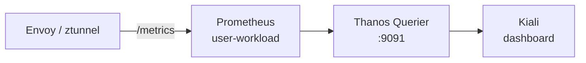

Patch the Kiali CR (`kiali` instance in the `kiali` namespace) to point at the in-cluster Thanos Querier endpoint:

```bash
oc patch kiali kiali -n kiali --type=merge -p '
spec:
  external_services:
    prometheus:
      url: "https://thanos-querier.openshift-monitoring.svc:9091"
      auth:
        type: "bearer"
        use_kiali_token: true
'
```

✅ Validation

```bash
oc get kiali kiali -n kiali -o jsonpath='{.spec.external_services.prometheus.url}'
```

Expected output:

```
https://thanos-querier.openshift-monitoring.svc:9091
```


### Fix 403 Error — Grant Kiali Monitoring Access

> **What:** Grant the Kiali ServiceAccount the `cluster-monitoring-view` ClusterRole.
>
> **Why:** Thanos Querier is protected by RBAC. Even though Kiali knows the endpoint, its ServiceAccount token will get a 403 unless it has explicit permission to read cluster-wide monitoring data. This is an OpenShift security boundary — platform metrics aren't exposed to arbitrary workloads by default.

After updating the endpoint you may see a **403 Forbidden** error. Grant the Kiali service account the required cluster role:

```bash
oc adm policy add-cluster-role-to-user cluster-monitoring-view \
  -z kiali-service-account -n kiali
```

✅ Validation

```bash
oc adm policy who-can get pods --subresource=prometheus-metrics -n openshift-monitoring | grep kiali-service-account
```

Or verify with:

```bash
oc get clusterrolebinding -o wide | grep kiali-service-account
```

Expected output (should show the `cluster-monitoring-view` binding):

```
cluster-monitoring-view-xxxxx   ClusterRole/cluster-monitoring-view   ...   kiali/kiali-service-account
```


## A. Sidecar mode

> **Reference:** [https://docs.redhat.com/en/documentation/red_hat_openshift_service_mesh/3.3/html-single/installing/index#ossm-sidecar-injection](https://docs.redhat.com/en/documentation/red_hat_openshift_service_mesh/3.3/html-single/installing/index#ossm-sidecar-injection)

In sidecar mode, every application pod gets an **Envoy proxy** injected as an additional container. All inbound and outbound traffic for the pod flows through this proxy, which handles mTLS, metrics collection, and policy enforcement transparently.

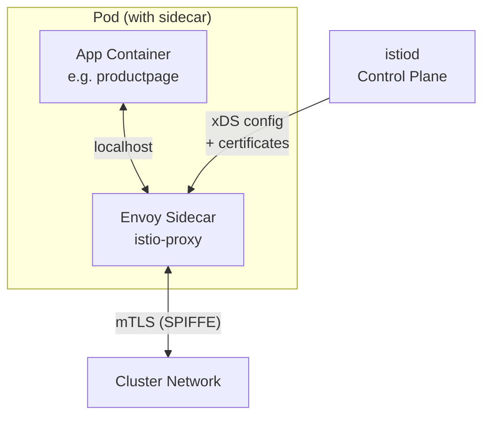

### A.1 Components installation


#### A.1.1 Install Istio CNI plugin

> **What:** Deploy the Istio CNI DaemonSet — one pod per node that configures network rules.
>
> **Why:** On OpenShift, pods run with restricted security contexts and cannot modify their own iptables. The CNI plugin runs as a privileged DaemonSet and sets up the network redirection rules (iptables/nftables) at pod creation time, so the sidecar can intercept traffic without the application needing elevated permissions.

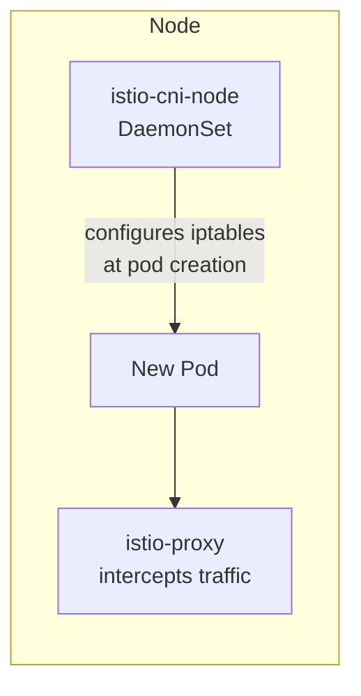

```bash
# Create istio-cni project
cat <<EOF | oc apply -f -
apiVersion: v1
kind: Namespace
metadata:  
  name: istio-cni
spec: {}
---
kind: IstioCNI
apiVersion: sailoperator.io/v1
metadata:
  name: default
spec:
  namespace: istio-cni
  version: v1.28.5
EOF
```

✅ Validation

```bash
oc get istiocni default -o jsonpath='{.status.state}'
```

Expected output:

```
Healthy
```

```bash
oc get pods -n istio-cni
```

Expected output (one pod per node):

```
NAME                   READY   STATUS    RESTARTS   AGE
istio-cni-node-xxxxx   1/1     Running   0          XXs
istio-cni-node-xxxxx   1/1     Running   0          XXs
...
```


#### A.1.2 Istio Control Plane

> **What:** Deploy `istiod` — the Istio control plane that manages the entire mesh.
>
> **Why:** istiod is the "brain" of the mesh. It:
> - Issues short-lived mTLS certificates (SPIFFE identities) to every proxy
> - Pushes routing rules, policies, and service discovery info via the xDS API
> - Watches only namespaces labelled `istio-discovery: enabled` (discovery selector), keeping the blast radius controlled
>
> Without istiod, the proxies have no configuration and no certificates.

```bash
# Create the control plane namespace and 
#  the Istio resource with a discovery selector
#  (only namespaces labelled istio-discovery=enabled will be managed)
cat <<EOF | oc apply -f -
apiVersion: v1
kind: Namespace
metadata:  
  name: istio-system
spec: {}
---
apiVersion: sailoperator.io/v1
kind: Istio
metadata:
  name: default
spec:
  namespace: istio-system
  values:
    meshConfig:
      discoverySelectors:
        - matchLabels:
            istio-discovery: enabled
EOF
```

✅ Validation

```bash
oc get istio default -o jsonpath='{.status.state}'
```

Expected output:

```
Healthy
```

```bash
oc get pods -n istio-system
```

Expected output:

```
NAME                      READY   STATUS    RESTARTS   AGE
istiod-xxxxx-xxxxx        1/1     Running   0          XXs
```


### A.2 Application deployment

#### A.2.1 Deploy the Bookinfo Application

> **What:** Deploy the Istio Bookinfo sample application — a polyglot microservices app with 4 services (productpage, details, reviews, ratings).
>
> **Why:** We deploy it first *without* the mesh to establish a baseline. You'll see each pod has exactly 1 container. After enabling sidecar injection, the count jumps to 2 — proving the proxy was injected transparently without changing the application manifests.

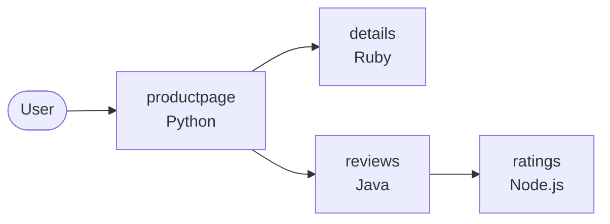

```bash
# Create the application namespace
cat <<EOF | oc apply -f -
apiVersion: v1
kind: Namespace
metadata:  
  name: bookinfo
spec: {}
EOF

# Deploy the Bookinfo sample app (without sidecars yet)
oc apply -f https://raw.githubusercontent.com/openshift-service-mesh/istio/release-1.24/samples/bookinfo/platform/kube/bookinfo.yaml -n bookinfo
```

✅ Validation

```bash
oc get pods -n bookinfo
```

Expected output (1 container per pod, no sidecar yet):

```
NAME                              READY   STATUS    RESTARTS   AGE
details-v1-xxxxx-xxxxx            1/1     Running   0          XXs
productpage-v1-xxxxx-xxxxx        1/1     Running   0          XXs
ratings-v1-xxxxx-xxxxx            1/1     Running   0          XXs
reviews-v1-xxxxx-xxxxx            1/1     Running   0          XXs
reviews-v2-xxxxx-xxxxx            1/1     Running   0          XXs
reviews-v3-xxxxx-xxxxx            1/1     Running   0          XXs
```


Optionally, expose the app directly to verify it works before mesh injection:

```bash
# Expose the productpage deployment
oc expose deployment/productpage -n bookinfo
 
# Create an edge-terminated route
cat <<EOF | oc apply -f -
apiVersion: route.openshift.io/v1
kind: Route
metadata:
  labels:
    app: productpage
    service: productpage
  name: productpage
  namespace: bookinfo
spec:
  port:
    targetPort: http
  tls:
    termination: edge
  to:
    kind: ""
    name: productpage
EOF
 
# Print the route URL
echo https://$(oc get -n bookinfo route productpage -ojsonpath='{.spec.host}')
```

You can also verify individual microservices from within the cluster (For instance, from the Web Terminal):

```bash
# Details service
curl -s http://details.bookinfo.svc:9080/details/0 | jq
 
# Reviews service
curl -s http://reviews.bookinfo.svc:9080/reviews/0 | jq
```


#### A.2.2 Enable Sidecar Injection

> **What:** Label the namespace with `istio-injection: enabled` and restart the pods.
>
> **Why:** The Istio mutating admission webhook watches for pods being created in labelled namespaces and automatically injects the `istio-proxy` container. Existing pods need a restart because injection only happens at pod creation time. After this step, all inter-service communication is automatically proxied through Envoy — enabling mTLS, metrics, and policy enforcement.

Label the namespace to enable both mesh discovery and automatic sidecar injection:

```bash
cat <<EOF | oc apply -f -
apiVersion: v1
kind: Namespace
metadata:
  name: bookinfo
  labels:
    istio-discovery: enabled
    istio-injection: enabled
EOF
```

Restart all workloads so the sidecars are injected, then watch the pods come back up:

```bash
# Trigger a rolling restart
oc rollout restart deployments -n bookinfo
 
# Watch pods — you should see 2 containers per pod (app + istio-proxy)
oc get pod -n bookinfo -w
```

✅ Validation

```bash
oc get namespace bookinfo --show-labels | grep istio
```

Expected output (should contain both labels):

```
bookinfo   Active   XXm   istio-discovery=enabled,istio-injection=enabled,...
```

```bash
oc get pods -n bookinfo -o custom-columns="NAME:.metadata.name,READY:.status.containerStatuses[*].ready,CONTAINERS:.spec.containers[*].name"
```

Expected output (2 containers per pod — app + istio-proxy):

```
NAME                              READY        CONTAINERS
details-v1-xxxxx-xxxxx            true,true    details,istio-proxy
productpage-v1-xxxxx-xxxxx        true,true    productpage,istio-proxy
ratings-v1-xxxxx-xxxxx            true,true    ratings,istio-proxy
reviews-v1-xxxxx-xxxxx            true,true    reviews,istio-proxy
reviews-v2-xxxxx-xxxxx            true,true    reviews,istio-proxy
reviews-v3-xxxxx-xxxxx            true,true    reviews,istio-proxy
```


#### A.2.3 Configure Prometheus Scraping

> **What:** Create a `PodMonitor` that tells Prometheus to scrape the Envoy proxy metrics endpoint.
>
> **Why:** Each Envoy sidecar exposes detailed L7 metrics (request count, latency histograms, error rates) on `/stats/prometheus`. However, Prometheus won't scrape them unless you explicitly create a `PodMonitor` resource. Without this, Kiali's traffic graph remains empty even though everything else is working — a common "gotcha" during setup.

Create a `PodMonitor` for all sidecar-injected pods in the `bookinfo` namespace:

```bash
cat <<EOF | oc apply -f -
apiVersion: monitoring.coreos.com/v1
kind: PodMonitor
metadata:
  name: bookinfo-proxies-monitor
  namespace: bookinfo
  labels:
    k8s-app: istio
spec:
  selector:
    matchExpressions:
    - key: security.istio.io/tlsMode
      operator: Exists
  podMetricsEndpoints:
  - path: /stats/prometheus
    port: http-envoy-prom
    interval: 15s
    relabelings:
    - action: keep
      sourceLabels: [__meta_kubernetes_pod_container_name]
      regex: "istio-proxy"
    - action: replace
      sourceLabels: [__meta_kubernetes_pod_label_app]
      targetLabel: app
    - action: replace
      sourceLabels: [__meta_kubernetes_pod_label_version]
      targetLabel: version
EOF
```

✅ Validation

```bash
oc get podmonitor -n bookinfo
```

Expected output:

```
NAME                       AGE
bookinfo-proxies-monitor   XXs
```

```bash
oc get pods -n openshift-user-workload-monitoring -l app.kubernetes.io/name=prometheus -o jsonpath='{.items[0].status.phase}'
```

Expected output (Prometheus is running and will pick up the new PodMonitor):

```
Running
```


### A.3. Security and Networking

#### A.3.1 Enforce mTLS

> **What:** Apply a `PeerAuthentication` policy with `mode: STRICT` to require mutual TLS for all traffic in the namespace.
>
> **Why:** By default, Istio uses "permissive" mTLS — it accepts both plaintext and encrypted connections. Setting STRICT means **only** clients with a valid mesh certificate (SPIFFE identity) can communicate with services in this namespace. This is the foundation of zero-trust networking: every connection is authenticated and encrypted, even inside the cluster.

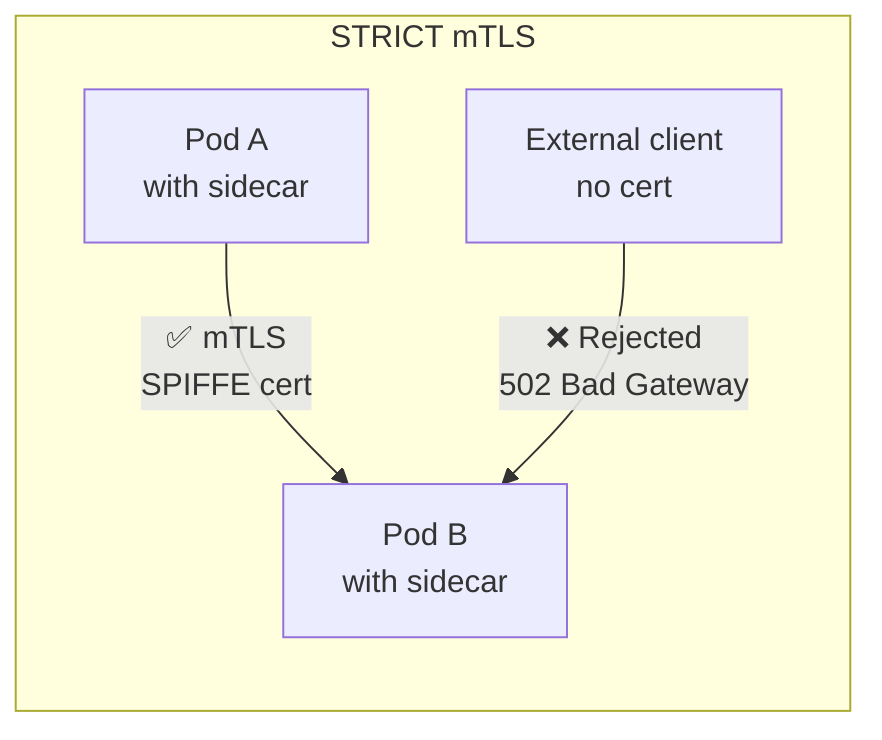

Apply a `PeerAuthentication` policy to enforce mutual TLS (mTLS) for all workloads in the `bookinfo` namespace:

```bash
cat <<EOF | oc apply -f -
apiVersion: security.istio.io/v1
kind: PeerAuthentication
metadata:
  name: default
  namespace: bookinfo
spec:
  mtls:
    mode: STRICT
EOF
```

✅ Validation

```bash
oc get peerauthentication -n bookinfo
```

Expected output:

```
NAME      MODE     AGE
default   STRICT   XXs
```

Verify mTLS is enforced (the direct route should now fail):

```bash
curl -sk https://$(oc get route productpage -n bookinfo -o jsonpath='{.spec.host}')/productpage
```

Expected output:

```
(empty response or 502 Bad Gateway)
```


> **Note:** Once STRICT mTLS is active, the direct `productpage` route created earlier will return a **502 Bad Gateway**, because the OpenShift Router cannot complete the mTLS handshake. An Istio Ingress Gateway is required — see Section 3.2.


#### A.3.2 Deploy the Ingress Gateway

> **What:** Deploy an Envoy-based Ingress Gateway as the entry point for external traffic into the mesh.
>
> **Why:** With STRICT mTLS enabled, the OpenShift Router can no longer reach the pods directly (it doesn't have a mesh certificate). The Ingress Gateway sits at the mesh edge: it terminates external TLS from the Router and initiates mTLS towards the backend pods. It's the "front door" that bridges the external world and the encrypted mesh.

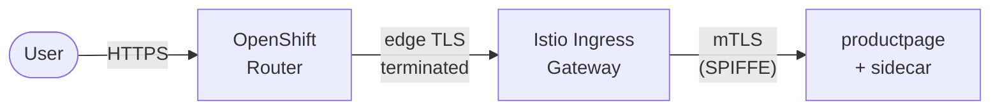

Deploy the Envoy-based ingress gateway workload (Service, Deployment, RBAC):

```bash
oc apply -f https://raw.githubusercontent.com/istio-ecosystem/sail-operator/main/chart/samples/ingress-gateway.yaml -n bookinfo
```

Create the Istio `Gateway` and `VirtualService` resources for Bookinfo:

```bash
oc apply -f https://raw.githubusercontent.com/openshift-service-mesh/istio/release-1.24/samples/bookinfo/networking/bookinfo-gateway.yaml -n bookinfo
```

Expose the ingress gateway via an OpenShift Route:

```bash
cat <<EOF | oc apply -f -
apiVersion: route.openshift.io/v1
kind: Route
metadata:
  name: istio-ingressgateway
  namespace: bookinfo
spec:
  port:
    targetPort: http2
  tls:
    termination: edge
  to:
    kind: Service
    name: istio-ingressgateway
EOF
```

✅ Validation

```bash
oc get pods -n bookinfo -l istio=ingressgateway
```

Expected output:

```
NAME                                    READY   STATUS    RESTARTS   AGE
istio-ingressgateway-xxxxx-xxxxx        2/2     Running   0          XXs
```

```bash
oc get route istio-ingressgateway -n bookinfo -o jsonpath='{.spec.host}'
```

Expected output:

```
istio-ingressgateway-bookinfo.apps.<cluster-domain>
```

Test the application through the ingress gateway:

```bash
curl -sk https://$(oc get route istio-ingressgateway -n bookinfo -o jsonpath='{.spec.host}')/productpage | grep -o "<title>.*</title>"
```

Expected output:

```
<title>Simple Bookstore App</title>
```


#### A.3.3 Inspect Certificate / SPIFFE Identity

> **What:** Extract and examine the X.509 certificate that istiod issued to a sidecar proxy.
>
> **Why:** Every proxy gets a short-lived certificate with a SPIFFE URI (`spiffe://cluster.local/ns/<namespace>/sa/<service-account>`) as its identity. This is what makes identity-based authorization possible — policies reference these URIs, not IP addresses. Inspecting the cert proves that the identity system is working and shows you the exact identity string to use in AuthorizationPolicies.

Use `istioctl` to inspect the certificate of any sidecar-injected pod:

```bash
# Set the pod name first
POD_TO_INSPECT=<pod-name>
 
istioctl proxy-config secret $POD_TO_INSPECT -n bookinfo -o json | \
  jq -r '.dynamicActiveSecrets[]? | select(.name=="default") | .secret.tlsCertificate.certificateChain.inlineBytes' | \
  base64 --decode | openssl x509 -text -noout
```

✅ Validation

The certificate output should contain a SPIFFE URI in the Subject Alternative Name:

```
X509v3 Subject Alternative Name: critical
    URI:spiffe://cluster.local/ns/bookinfo/sa/<service-account-name>
```


#### A.3.4 Test with a Sleep Pod

> **What:** Deploy a minimal curl pod *inside* the mesh (with sidecar) to test service-to-service connectivity.
>
> **Why:** Since STRICT mTLS is active, you can't test from outside the mesh anymore. The sleep pod gets its own SPIFFE identity and can make authenticated mTLS calls to other services. This lets you verify that mesh-internal connectivity works before adding authorization restrictions.

Deploy a curl-based pod with sidecar injection enabled to test connectivity from within the mesh:

```bash
oc run sleep \
  --image=curlimages/curl \
  --restart=Never \
  -n bookinfo \
  --labels="sidecar.istio.io/inject=true" \
  -- sleep 3600
```

Exec into the pod (e.g. via the OpenShift Web Terminal) and test access to the Reviews service:

```bash
curl -I -X GET reviews:9080/reviews/0
# Expected: HTTP 200 OK
```

✅ Validation

```bash
oc get pod sleep -n bookinfo -o jsonpath='{.status.containerStatuses[*].name}'
```

Expected output (pod running with sidecar):

```
sleep istio-proxy
```

From inside the sleep pod:

```bash
oc exec sleep -n bookinfo -c sleep -- curl -s -o /dev/null -w "%{http_code}" reviews:9080/reviews/0
```

Expected output:

```
200
```


#### A.3.5 Authorization Policy

> **What:** Create an `AuthorizationPolicy` that only allows `productpage` (by its SPIFFE identity) to call the `reviews` service.
>
> **Why:** This is zero-trust in action. Even though `sleep` and `productpage` are both in the mesh with valid certificates, only the explicitly allowed identity can reach `reviews`. Every other caller gets a 403 Forbidden. This is a powerful security primitive: access is based on cryptographic identity, not network location or IP addresses.

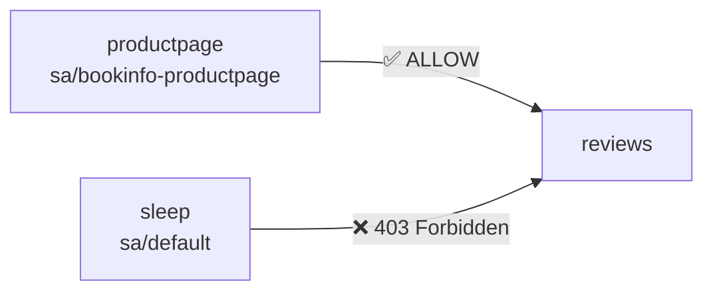

Restrict access to the `reviews` service so that only `productpage` (identified by its SPIFFE/mTLS identity) is permitted:

```bash
cat <<EOF | oc apply -f -
apiVersion: security.istio.io/v1
kind: AuthorizationPolicy
metadata:
  name: reviews-identity-enforcement
  namespace: bookinfo
spec:
  selector:
    matchLabels:
      app: reviews
  action: ALLOW
  rules:
  - from:
    - source:
        principals: ["cluster.local/ns/bookinfo/sa/bookinfo-productpage"]
EOF
```

After applying this policy, the `sleep` pod should receive a **403 Forbidden** when attempting to reach `reviews`, while `productpage` continues to work normally.

✅ Validation

```bash
oc get authorizationpolicy -n bookinfo
```

Expected output:

```
NAME                           AGE
reviews-identity-enforcement   XXs
```

Verify that the sleep pod is now denied access to reviews:

```bash
oc exec sleep -n bookinfo -c sleep -- curl -s -o /dev/null -w "%{http_code}" reviews:9080/reviews/0
```

Expected output:

```
403
```

Verify that productpage can still reach reviews (app still works end-to-end):

```bash
curl -sk https://$(oc get route istio-ingressgateway -n bookinfo -o jsonpath='{.spec.host}')/productpage | grep -o "<title>.*</title>"
```

Expected output:

```
<title>Simple Bookstore App</title>
```


### A.4. Cleanup

```
oc delete namespace bookinfo
oc delete istio default
oc delete istiocni default
oc delete namespace istio-system
oc delete namespace istio-cni
```

---


## B. Ambient mode

Ambient mode is a fundamentally different architecture from sidecar mode. Instead of injecting a proxy into every pod, it uses **shared infrastructure** at the node level:

- **ztunnel** (per-node DaemonSet): Handles L4 concerns — mTLS encryption, connection-level telemetry, and basic authorization. All pods on the node share this component.
- **Waypoint proxy** (per-namespace, optional): Handles L7 concerns — HTTP routing, request-level metrics, and L7 authorization policies. Only deployed when you need it.

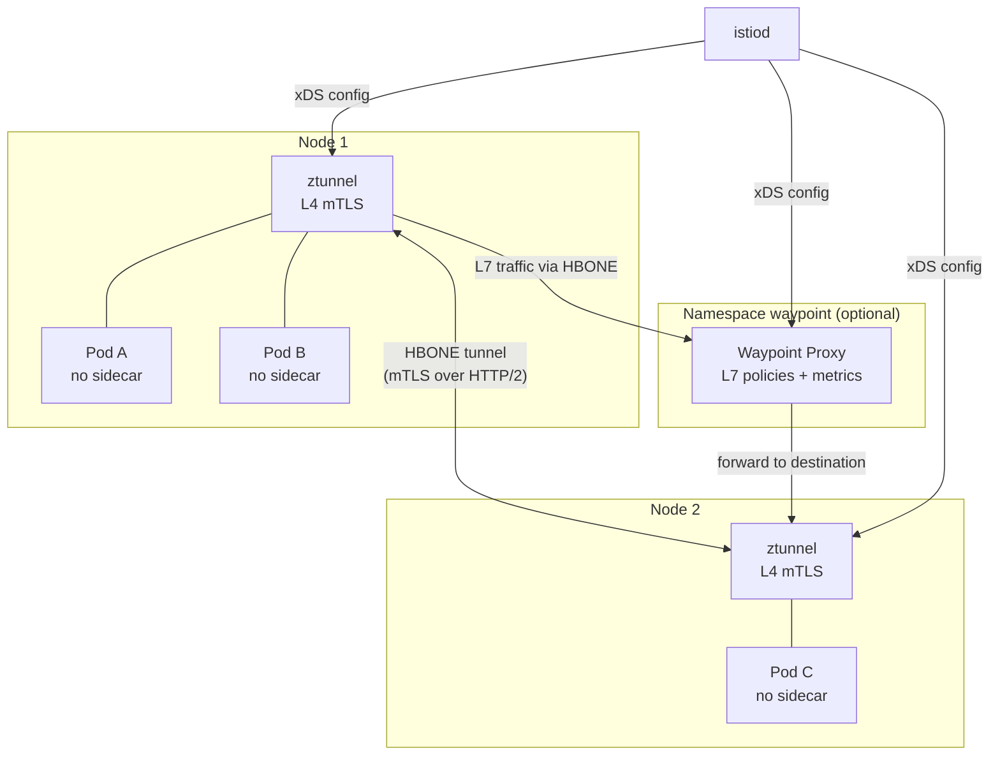

The key advantage: **pods don't need to be restarted** to join the mesh. Labelling the namespace is enough, and ztunnel picks up traffic transparently.

### B.0 Prerequisites — Configure Cluster Networking

> **What:** Enable `routingViaHost` in the OVN-Kubernetes network plugin configuration.
>
> **Why:** Ambient mode's ztunnel runs on the host network namespace and intercepts pod traffic using nftables rules. For this interception to work, pod egress traffic must be routed through the host network stack (rather than being bridged directly). This is a cluster-wide change that affects how OVN-Kubernetes handles the default gateway for pods.

> **Reference:** [https://docs.redhat.com/en/documentation/red_hat_openshift_service_mesh/3.3/html-single/installing/index#ossm-istio-ambient-mode](https://docs.redhat.com/en/documentation/red_hat_openshift_service_mesh/3.3/html-single/installing/index#ossm-istio-ambient-mode)

Ambient mode requires that OVN-Kubernetes routes traffic via the host. Patch the cluster Network Operator to enable `routingViaHost`:

```bash
oc patch network.operator cluster --type=merge -p '
spec:
  defaultNetwork:
    ovnKubernetesConfig:
      gatewayConfig:
        routingViaHost: true
'
```

> **Note:** This change triggers a rolling reboot of the cluster nodes. Wait for all nodes to return to `Ready` before proceeding.

✅ Validation

```bash
oc get network.operator cluster -o jsonpath='{.spec.defaultNetwork.ovnKubernetesConfig.gatewayConfig.routingViaHost}'
```

Expected output:

```
true
```

Confirm all nodes are back to Ready:

```bash
oc get nodes -o custom-columns="NAME:.metadata.name,STATUS:.status.conditions[-1].type,READY:.status.conditions[-1].status" | grep -v "True"
```

Expected output (no nodes should appear — all are Ready):

```
NAME    STATUS   READY
```


### B.1 Components installation

For scoping the service mesh with discovery selector to limit the scope of the OSSM in Istio ambient mode. The configuration controls which namespaces the control plane discovers based on label selectors. 

#### B.1.1. Install ZTunnel

> **What:** Deploy the ztunnel DaemonSet — a lightweight, Rust-based L4 proxy that runs on every node.
>
> **Why:** ztunnel is the core data-plane component in ambient mode. It transparently intercepts all TCP traffic from enrolled pods and wraps it in mTLS (using the HBONE protocol — HTTP/2-based tunneling). Unlike Envoy sidecars, ztunnel only handles L4 (connection-level) concerns, making it significantly lighter on resources.

```bash
cat <<EOF | oc apply -f -
apiVersion: v1
kind: Namespace
metadata:  
  name: istio-ztunnel
spec: {}
---
apiVersion: sailoperator.io/v1
kind: ZTunnel
metadata:
  name: default
  namespace: istio-ztunnel
  labels:
    istio-discovery: enabled
spec:
  namespace: istio-ztunnel
  profile: ambient
EOF
```

✅ Validation

The validation steps for step B.1.1 we should do after step B.1.3


#### B.1.2. Install Istio CNI plugin

> **What:** Install the Istio CNI plugin with the `ambient` profile.
>
> **Why:** In ambient mode, the CNI plugin configures nftables rules that redirect pod traffic to the ztunnel process on the node. This is different from sidecar mode where it sets up iptables for the sidecar — here it redirects to the node-level ztunnel instead. Without it, pod traffic bypasses the mesh entirely.

We install the Istio CNI in ambient mode as well

```bash
# Create istio-cni project and IstioCNI
cat <<EOF | oc apply -f -
apiVersion: v1
kind: Namespace
metadata:  
  name: istio-cni
  labels:
    istio-discovery: enabled
spec: {}
---
apiVersion: sailoperator.io/v1
kind: IstioCNI
metadata:
  name: default
spec:
  namespace: istio-cni
  profile: ambient
EOF
```

✅ Validation

```bash
oc get istiocni default -o jsonpath='{.status.state}'
```

Expected output:

```
Healthy
```

```bash
oc get pods -n istio-cni -l k8s-app=istio-cni-node
```

Expected output (one pod per node):

```
NAME                   READY   STATUS    RESTARTS   AGE
istio-cni-node-xxxxx   1/1     Running   0          XXs
istio-cni-node-xxxxx   1/1     Running   0          XXs
...
```


#### B.1.3. Install Istio control plane

> **What:** Deploy istiod with the `ambient` profile and configure it to trust the ztunnel namespace.
>
> **Why:** istiod in ambient mode has additional responsibilities compared to sidecar mode: it provisions certificates for ztunnel (not individual pods), manages waypoint proxy configurations, and coordinates the HBONE tunnel setup. The `trustedZtunnelNamespace` tells istiod which namespace hosts the ztunnel DaemonSet it should trust for certificate requests.

We install the istio resource in ambient mode: 

```bash
cat <<EOF | oc apply -f -
apiVersion: v1
kind: Namespace
metadata:  
  name: istio-system
  labels:
    istio-discovery: enabled
spec: {}
---
apiVersion: sailoperator.io/v1
kind: Istio
metadata:
  name: default
spec:
  namespace: istio-system
  profile: ambient
  values:
    pilot:
      trustedZtunnelNamespace: istio-ztunnel
  meshConfig:
    discoverySelectors:
    - matchLabels:
        istio-discovery: enabled
EOF
```

✅ Validation

```bash
oc get istio default -o jsonpath='{.status.state}'
```

Expected output:

```
Healthy
```

```bash
oc get pods -n istio-system
```

Expected output:

```
NAME                      READY   STATUS    RESTARTS   AGE
istiod-xxxxx-xxxxx        1/1     Running   0          XXs
```

We can now also check for the creation of ztunnel

```bash
oc get ztunnel default -n istio-ztunnel -o jsonpath='{.status.state}'
```

Expected output:

```
Healthy
```

```bash
oc get pods -n istio-ztunnel -l app=ztunnel
```

Expected output (one pod per node):

```
NAME              READY   STATUS    RESTARTS   AGE
ztunnel-xxxxx     1/1     Running   0          XXs
ztunnel-xxxxx     1/1     Running   0          XXs
...
```


## B.2 Deploy the bookinfo app

> **What:** Deploy the same Bookinfo app, but this time enrol the namespace into ambient mode via the `istio.io/dataplane-mode: ambient` label.
>
> **Why:** Unlike sidecar mode, you don't need to restart pods or inject containers. The moment the namespace is labelled, ztunnel begins intercepting traffic for all pods in it. Notice the pods still show 1/1 containers — no sidecar is injected. The mesh is completely transparent at the infrastructure level.

```bash
cat <<EOF | oc apply -f -
apiVersion: v1
kind: Namespace
metadata:  
  name: bookinfo
  labels:
    istio-discovery: enabled
    istio.io/dataplane-mode: ambient
spec: {}
EOF
oc apply -n bookinfo -f https://raw.githubusercontent.com/openshift-service-mesh/istio/release-1.24/samples/bookinfo/platform/kube/bookinfo.yaml
oc apply -n bookinfo -f https://raw.githubusercontent.com/openshift-service-mesh/istio/release-1.24/samples/bookinfo/platform/kube/bookinfo-versions.yaml
```

✅ Validation

```bash
oc get pods -n bookinfo
```

Expected output (1 container per pod — no sidecar in ambient mode):

```
NAME                              READY   STATUS    RESTARTS   AGE
details-v1-xxxxx-xxxxx            1/1     Running   0          XXs
productpage-v1-xxxxx-xxxxx        1/1     Running   0          XXs
ratings-v1-xxxxx-xxxxx            1/1     Running   0          XXs
reviews-v1-xxxxx-xxxxx            1/1     Running   0          XXs
reviews-v2-xxxxx-xxxxx            1/1     Running   0          XXs
reviews-v3-xxxxx-xxxxx            1/1     Running   0          XXs
```

```bash
oc get namespace bookinfo --show-labels | grep ambient
```

Expected output (should contain the ambient label):

```
bookinfo   Active   XXs   istio-discovery=enabled,istio.io/dataplane-mode=ambient,...
```


Confirm that Ztunnel proxy has successfully opened listening sockets in the pod network namespace by running the following command:

```bash
istioctl ztunnel-config workloads --namespace istio-ztunnel
```

✅ Validation

The output should list all bookinfo workloads with their IP addresses and `PROTOCOL: HBONE`:

```
NAMESPACE   POD NAME                          IP           NODE        WAYPOINT   PROTOCOL
bookinfo    details-v1-xxxxx-xxxxx            10.x.x.x    worker-0               HBONE
bookinfo    productpage-v1-xxxxx-xxxxx        10.x.x.x    worker-0               HBONE
bookinfo    ratings-v1-xxxxx-xxxxx            10.x.x.x    worker-1               HBONE
bookinfo    reviews-v1-xxxxx-xxxxx            10.x.x.x    worker-1               HBONE
...
```


#### Install the Waypoint Proxy

> **What:** Deploy a waypoint proxy (an Envoy instance managed via the Kubernetes Gateway API) and enrol the namespace to route traffic through it.
>
> **Why:** ztunnel only handles L4 (TCP-level) — it can encrypt traffic and enforce connection-level policies, but it cannot inspect HTTP headers, route by path, or collect L7 metrics. The waypoint proxy adds L7 capabilities (HTTP routing, request-level authorization, detailed metrics) for services that need it. It's a **shared** Envoy instance for the namespace, not one per pod.

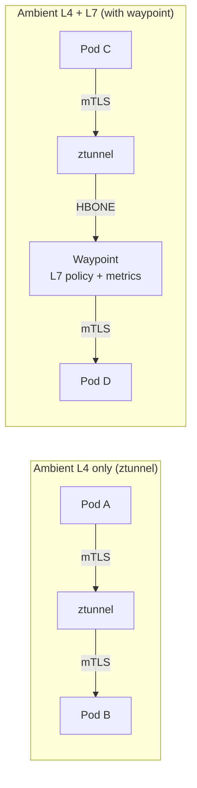

```bash
cat <<EOF | oc apply -f -
apiVersion: gateway.networking.k8s.io/v1
kind: Gateway
metadata:
  labels:
    istio.io/waypoint-for: service
  name: waypoint
  namespace: bookinfo
spec:
  gatewayClassName: istio-waypoint
  listeners:
  - name: mesh
    port: 15008
    protocol: HBONE
EOF
```

Enroll the bookinfo namespace to use the waypoint

```bash
oc label namespace bookinfo istio.io/use-waypoint=waypoint
```

✅ Validation

```bash
oc get gateway waypoint -n bookinfo -o jsonpath='{.status.conditions[?(@.type=="Programmed")].status}'
```

Expected output:

```
True
```

```bash
oc get pods -n bookinfo -l gateway.networking.k8s.io/gateway-name=waypoint
```

Expected output:

```
NAME                        READY   STATUS    RESTARTS   AGE
waypoint-xxxxx-xxxxx        1/1     Running   0          XXs
```

Check enrollment:

```bash
istioctl ztunnel-config svc --namespace istio-ztunnel
```

Expected output (services should show the waypoint address):

```
NAMESPACE   SERVICE NAME   SERVICE VIP   WAYPOINT          PROTOCOL
bookinfo    details        10.x.x.x      10.x.x.x:15008   HBONE
bookinfo    productpage    10.x.x.x      10.x.x.x:15008   HBONE
bookinfo    ratings        10.x.x.x      10.x.x.x:15008   HBONE
bookinfo    reviews        10.x.x.x      10.x.x.x:15008   HBONE
...
```


#### Configure Metrics Scraping

> **What:** Create `PodMonitor` resources for both ztunnel and the waypoint proxy.
>
> **Why:** In ambient mode, metrics are split across two components: ztunnel emits L4 connection metrics (bytes sent/received, connection duration) and the waypoint emits L7 request metrics (HTTP status codes, latency). Both need their own PodMonitor so Prometheus scrapes them and Kiali can render the complete traffic graph.

```bash
cat <<EOF | oc apply -f - 
apiVersion: monitoring.coreos.com/v1
kind: PodMonitor
metadata:
  name: ztunnel-monitor
  namespace: istio-ztunnel
spec:
  selector:
    matchLabels:
      app: ztunnel
  podMetricsEndpoints:
  - port: ztunnel-stats
    path: /metrics
    interval: 15s
---
apiVersion: monitoring.coreos.com/v1
kind: PodMonitor
metadata:
  name: waypoint-monitor
  namespace: bookinfo
spec:
  selector:
    matchLabels:
      gateway.networking.k8s.io/gateway-name: waypoint
  podMetricsEndpoints:
  - port: metrics
    path: /metrics
    interval: 15s
EOF
```

✅ Validation

```bash
oc get podmonitor -n istio-ztunnel
```

Expected output:

```
NAME               AGE
ztunnel-monitor    XXs
```

```bash
oc get podmonitor -n bookinfo
```

Expected output:

```
NAME                AGE
waypoint-monitor    XXs
```


### B.3. Security and Networking

#### Expose the Application via Kubernetes Gateway API

> **What:** Create a Kubernetes Gateway (using `gatewayClassName: istio`) and an HTTPRoute to expose the bookinfo app externally.
>
> **Why:** In ambient mode, we use the standard **Kubernetes Gateway API** (rather than Istio's older `Gateway`/`VirtualService` CRDs). This is a more portable, upstream-first approach. The `istio` gatewayClassName tells the Sail Operator to spin up an Envoy pod that acts as the ingress. We then create an OpenShift Route to bridge external HTTPS traffic to this gateway.

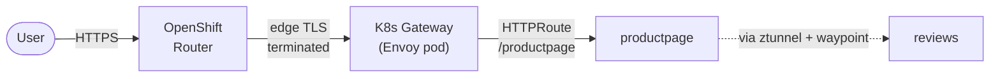

We can expose the app via a Gateway (k8s): 

```bash
# Create the Gateway
cat <<EOF | oc apply -f -
apiVersion: gateway.networking.k8s.io/v1
kind: Gateway
metadata:
  name: bookinfo-ingress-gateway
  namespace: bookinfo
  annotations:
    networking.istio.io/service-type: ClusterIP
spec:
  gatewayClassName: istio
  listeners:
  - name: http
    port: 80
    protocol: HTTP
    allowedRoutes:
      namespaces:
        from: Same
EOF
```

✅ Validation

```bash
oc get gateway bookinfo-ingress-gateway -n bookinfo -o jsonpath='{.status.conditions[?(@.type=="Programmed")].status}'
```

Expected output:

```
True
```

```bash
oc get pods -n bookinfo -l gateway.networking.k8s.io/gateway-name=bookinfo-ingress-gateway
```

Expected output:

```
NAME                                              READY   STATUS    RESTARTS   AGE
bookinfo-ingress-gateway-istio-xxxxx-xxxxx        1/1     Running   0          XXs
```


After the gateway is deployed, we will see the envoy proxy that has been spinned up by the previous CRD (gatewayClassName istio). We can now create an HTTPRoute object that will inject the traffic into the mesh

```bash
cat <<EOF | oc apply -f -
apiVersion: gateway.networking.k8s.io/v1
kind: HTTPRoute
metadata:
  name: bookinfo-entry-route
  namespace: bookinfo
spec:
  parentRefs:
  - name: bookinfo-ingress-gateway
  rules:
  - matches:
    - path:
        type: Exact
        value: /productpage
    - path:
        type: PathPrefix
        value: /static
    - path:
        type: Exact
        value: /login
    - path:
        type: Exact
        value: /logout
    - path:
        type: PathPrefix
        value: /api/v1/products
    backendRefs:
    - name: productpage
      port: 9080
EOF
```

Now, we can create a route to the gateway. 

```bash
cat <<EOF | oc apply -f -
apiVersion: route.openshift.io/v1
kind: Route
metadata:
  name: main
  namespace: bookinfo
spec:
  to:
    kind: Service
    name: bookinfo-ingress-gateway-istio
    weight: 100
  port:
    targetPort: 80 # The port defined in your Gateway listener
  tls:
    termination: edge # Optional: Let the OpenShift Router handle external TLS
    insecureEdgeTerminationPolicy: Redirect
EOF
```

✅ Validation

```bash
oc get httproute -n bookinfo
```

Expected output:

```
NAME                   HOSTNAMES   AGE
bookinfo-entry-route               XXs
```

```bash
oc get route main -n bookinfo -o jsonpath='{.spec.host}'
```

Expected output:

```
main-bookinfo.apps.<cluster-domain>
```

Test the application through the route:

```bash
curl -sk https://$(oc get route main -n bookinfo -o jsonpath='{.spec.host}')/productpage | grep -o "<title>.*</title>"
```

Expected output:

```
<title>Simple Bookstore App</title>
```


We check that we can reach the pod from outside the mesh (Web Terminal, for instance) 

```bash
# It reteurns the info about the author (William Shakespeare) and the publication
curl http://details.bookinfo.svc:9080/details/0 
```

#### Restart Pods for nftables Enrollment

> **What:** Perform a rolling restart of all deployments and generate traffic.
>
> **Why:** If the pods were created *before* the ambient label was applied to the namespace, the CNI plugin hasn't yet configured the nftables interception rules for those pods. A restart triggers the CNI plugin to set up the rules at pod creation time. After this, traffic flows through ztunnel and appears in Kiali.

Restart all workloads so the nftables rules are applied, then watch the pods come back up:

```bash
# Trigger a rolling restart
oc rollout restart deployments -n bookinfo
 
# Watch pods — you should see 2 containers per pod (app + istio-proxy)
oc get pod -n bookinfo -w
```

✅ Validation

```bash
oc get pods -n bookinfo -l app=productpage -o jsonpath='{.items[0].status.phase}'
```

Expected output:

```
Running
```

Generate some traffic and verify Kiali can see the graph:

```bash
for i in $(seq 1 5); do curl -sk https://$(oc get route main -n bookinfo -o jsonpath='{.spec.host}')/productpage > /dev/null; done
```


#### Enforce mTLS in Ambient Mode

> **What:** Apply `PeerAuthentication` with STRICT mode — same CRD as sidecar mode.
>
> **Why:** This demonstrates that the same security policies work across both architectures. In ambient mode, ztunnel enforces the STRICT requirement: any connection that doesn't present a valid mesh identity is rejected at the L4 level. Clients outside the mesh (like the Web Terminal pod) will see their connections immediately reset because ztunnel drops them before they reach the application.

```bash
cat <<EOF | oc apply -f -
apiVersion: security.istio.io/v1
kind: PeerAuthentication
metadata:
  name: default
  namespace: bookinfo
spec:
  mtls:
    mode: STRICT
EOF
```

Now a cURL from the web terminal will not succeed. 

```bash
# Now, we get an error
curl http://details.bookinfo.svc:9080/details/0 
```

We can explore, then, the gateway logs: 

```bash
# Will show the blocked request after applying the PeerAuthorization CRD at namespace level.  
oc logs -n istio-ztunnel -l app=ztunnel -c istio-proxy --tail=100 | grep details
```

✅ Validation

```bash
oc get peerauthentication -n bookinfo
```

Expected output:

```
NAME      MODE     AGE
default   STRICT   XXs
```

Verify mTLS enforcement (plain HTTP from outside the mesh should fail):

```bash
oc exec -n openshift-console deployment/console -c console -- curl -s -o /dev/null -w "%{http_code}" http://details.bookinfo.svc:9080/details/0
```

Expected output (connection refused or reset):

```
000
```

Check ztunnel logs for denied connections:

```bash
oc logs -n istio-ztunnel -l app=ztunnel -c istio-proxy --tail=20 | grep -i "denied\|RBAC\|details"
```

Expected output (should show denied/blocked entries):

```
... inbound connection from ... denied ...
```


### B.4. Cleanup

```
oc delete istio default
oc delete istiocni default
oc delete ztunnel default
oc delete namespace bookinfo
oc delete namespace istio-system
oc delete namespace istio-cni
oc delete namespace istio-ztunnel
```

